原文：[パラメータを調整する](https://manual.voisona.com/ja/song/pc/2b6e9bc7efb1802fa1c0e3bb3223e086)

---

# 调整参数

在 VoiSona 中可以进行各式各样的调整，无论是调整影响整首歌曲的参数，还是微调节奏和颤音。

## 调整整首歌曲的参数

每个轨道都可以调整影响整首歌曲的参数。

1. 点击「参数」按钮，显示面板。
2. 直接输入数值或使用滑块进行调整。
   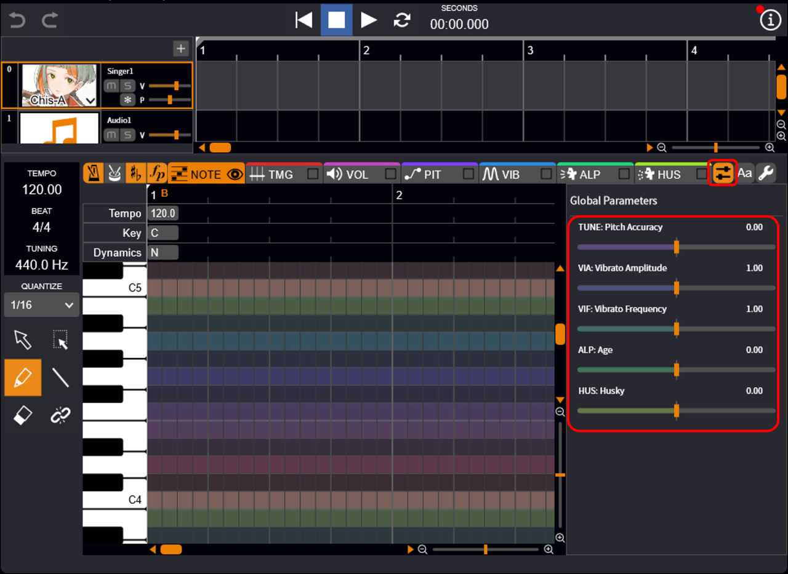

!!! info "可调整的参数"
      - TUNE（精准音高）：与音符音高的相符程度。数值越低，离音符的音高越远；数值越高，越接近音符的音高。
      - VIA（颤音幅度）：颤音的幅度。数值越大，振幅越大。
      - VIF（颤音频率）：颤音的频率。数值越大，周期越短、越细密。
      - ALP（音色/声质）：声音的音色/质感。数值越小越像小孩，数值越大越像大人。
      - HUS（沙哑度）：声音的沙哑程度。数值越大，声音越沙哑。

---

## 更详细的参数调整

切换调整画面可以进行更详细的参数设置。

可以通过标签页切换各参数的调整画面，也可以在标签页上设置各个参数的显示或隐藏。

### 调整时间

可以调整音素开始或结束的时间。

1. 点击「TMG」显示调整画面。
2. 选择「画笔工具」或「直线工具」。
3. 拖动状态线。
   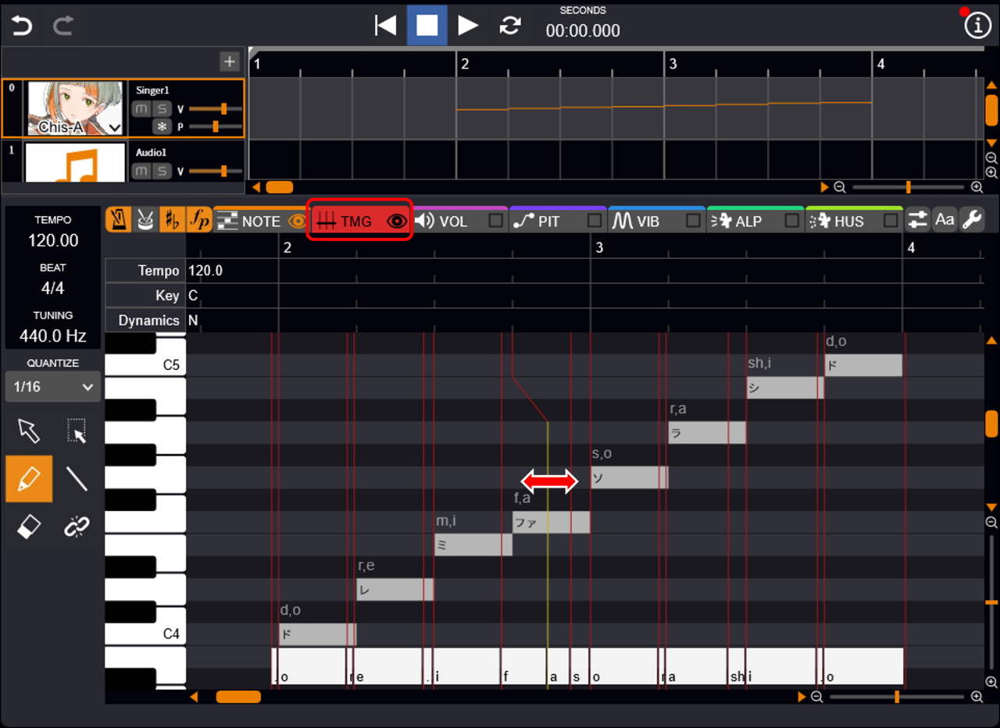

---

#### 以更细粒度调整

在「环境设置」的「编辑器」标签页中，勾选「时间状态线」。

此时将显示把音素进一步分为 5 个部分的音素状态线，从而可以进行更精细的时间调整。

!!! info
      在比音素更细的粒度上调整时间，效果可能不太明显。
      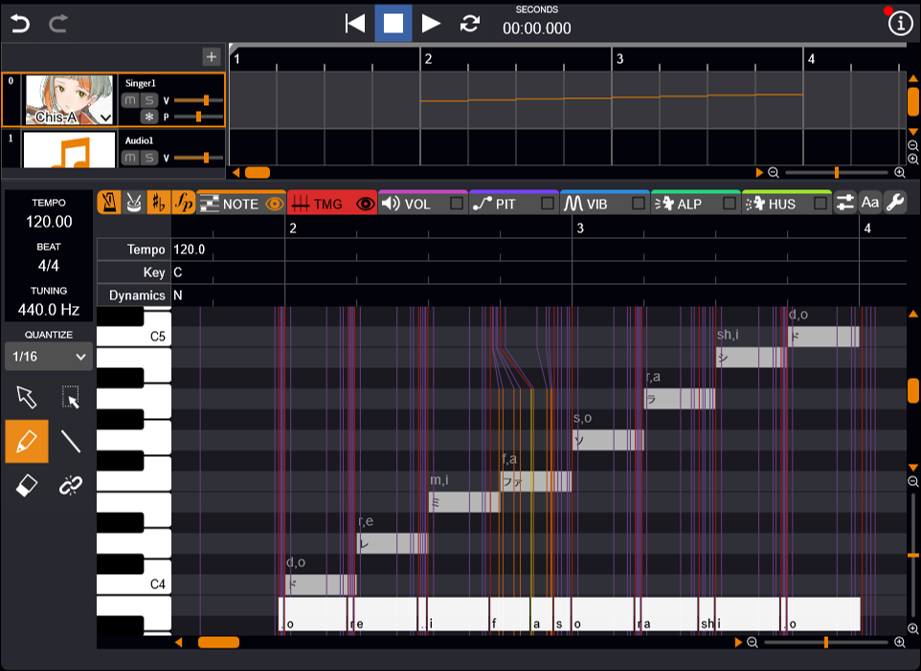

---

#### 将元音修正到音符开头

使用「选择工具」指定范围后，右键点击选择「元音时间修正」。

这样便会自动调整状态线，使元音位于音符开头。

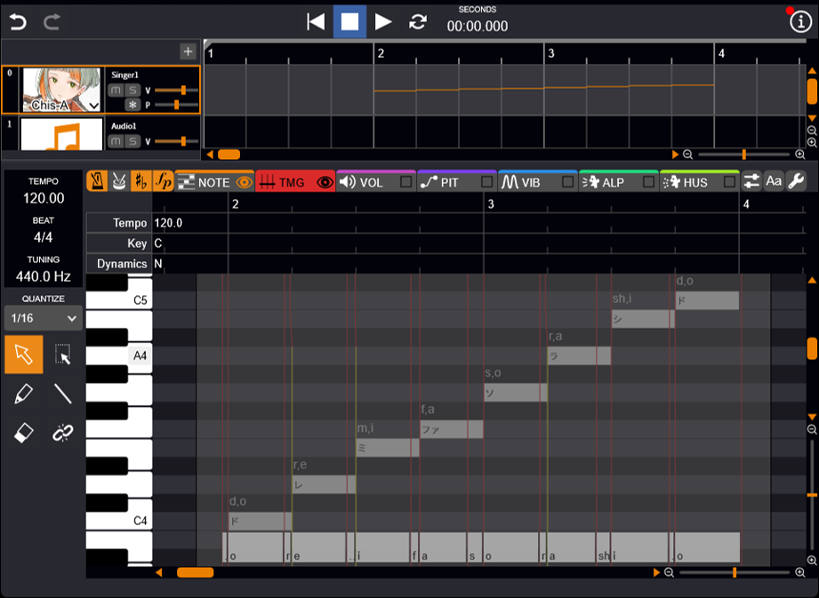

---

### 调整其他参数

其他参数也可以轻松自由地调整。

1. 点击「VOL」「PIT」「ALP」「HUS」之一显示调整画面。
2. 选择「画笔工具」或「直线工具」。
3. 绘制线条。
   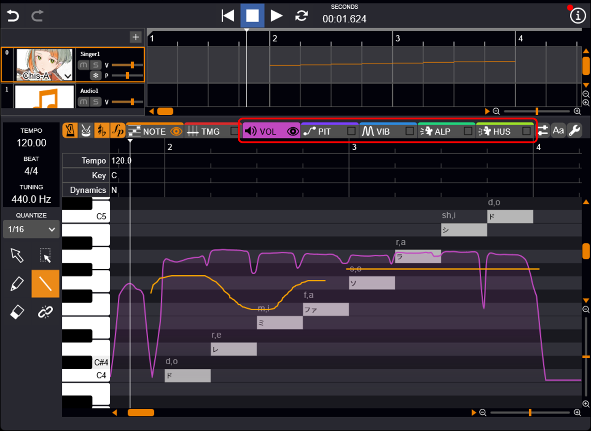

!!! info "可调整的参数"
      - VOL（音量）：单位是 dB（分贝）。
      - PIT（音高）：单位是 Hz（赫兹）。
      - ALP（音色/声质）：数值越小越像小孩，数值越大越像大人。
      - HUS（沙哑度）：数值越大，声音越沙哑。

---

#### 复制参数线条

要复制参数线条，请使用「选择工具」选择范围后，执行以下任一操作：

- 仅复制自己绘制的线条：复制后，使用播放位置光标指定位置，然后粘贴。
  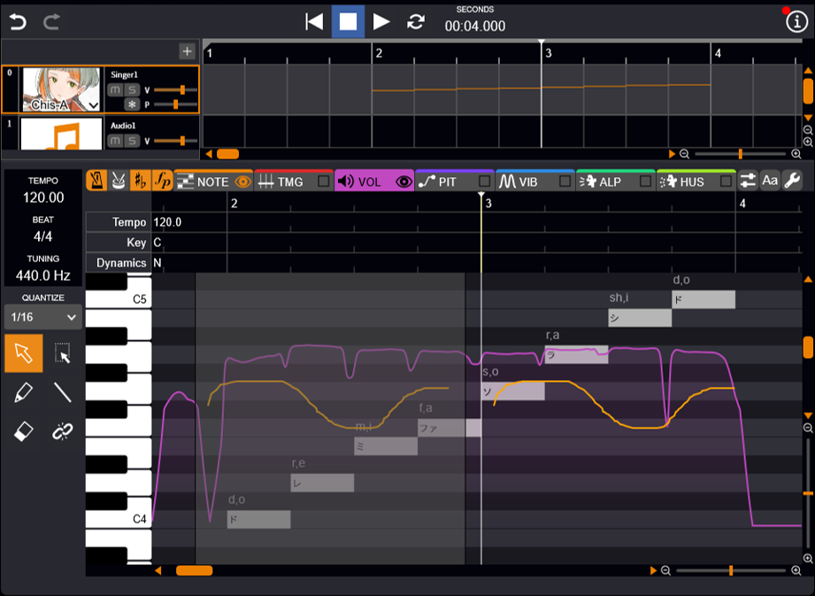
- 复制原始线条和自己绘制的线条：上下拖动范围内的线条。自己绘制线条的部分会被覆盖，其他部分则直接复制原始参数线条。
  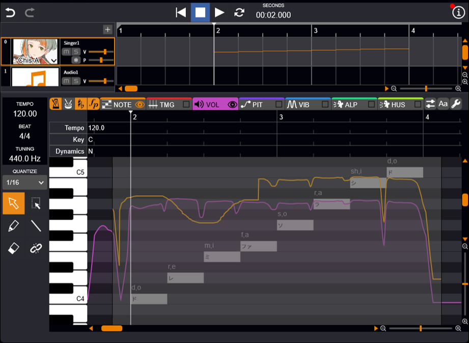

---

#### 禁用参数效果

在 PIT 和 VIB（Detailed 模式）中，可以禁用已绘制参数的效果。

按住 <kbd>Shift</kbd> 键的同时使用「橡皮擦工具」拖动原本设置的参数线条，线条将变为白色，此时该部分的参数将被禁用。

!!! info
      禁用部分的效果如下：

      - PIT：失去音高，变为沙哑的歌声。
      - VIB：没有颤音，变为平坦的歌声。

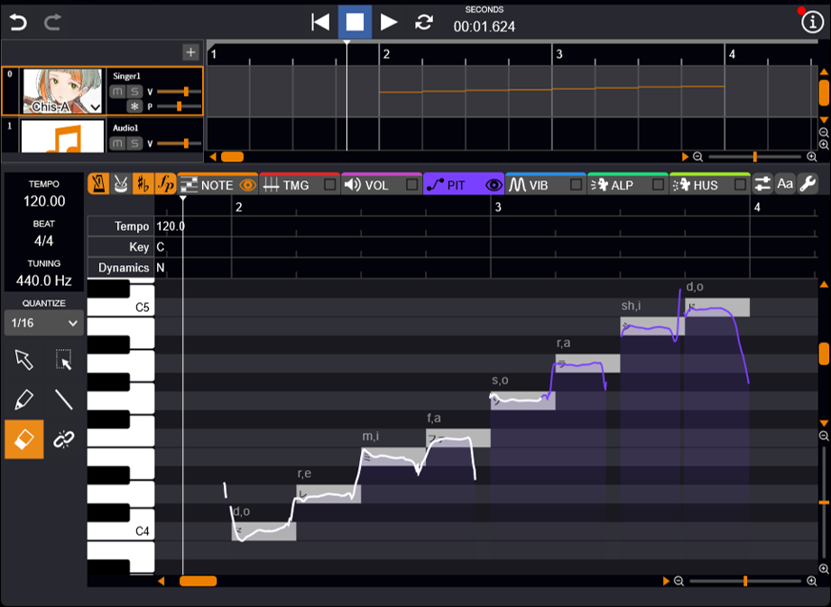

---

#### 连接调整模式

调整音高、音量和颤音时，按住 <kbd>Alt</kbd> 键拖动，可以绘制平滑连接到原始值的线条。

按住 <kbd>Alt</kbd> 键拖动时会绘制红色的线条，松开 <kbd>Alt</kbd> 键后，画出的红线和原始的参数线将会自动连接并作为新的调整值。

按住 <kbd>Alt</kbd> 键期间会显示一条反映当前调整值的线条，可以轻松确认有效值。

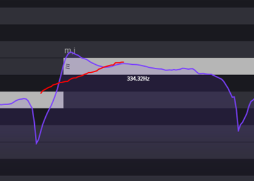
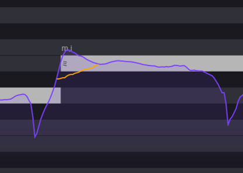

---

### 颤音调整

可以添加新的颤音，或调整振幅和周期。

提供了两种模式，可在直观操作（Simplified 模式）和自由编辑（Detailed 模式）之间切换。

1. 点击「VIB」显示调整画面。
2. 选择「画笔工具」或「直线工具」。
3. 编辑颤音区间。默认是 Simplified 模式，可进行以下操作：
    - 新建：绘制线条时将自动创建新的框。
    - 调整开始/结束位置：光标对准框的边缘，变为箭头后左右拖动。
    - 调整振幅：光标对准框，变为箭头后上下拖动。
    - 调整频率：从框内向外左右拖动。
      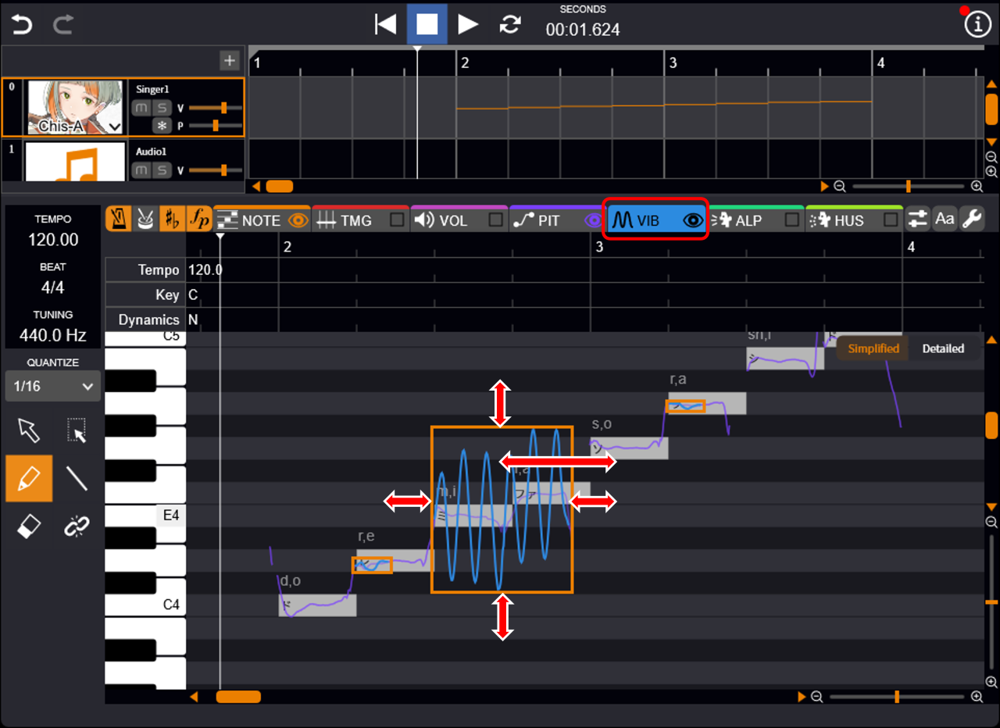

!!! info "关于振幅与频率"
      - 振幅：单位是 Cent（音分），100 Cent 相当于上下半音。数值越大，波的上下振幅越大。
      - 频率：单位是 Hz（赫兹），表示每秒波振动的次数。数值越大，波越细密（振幅间隔越短）。

---

#### 更自由的调整（Detailed 模式）

点击钢琴卷帘右上角的「Detailed」按钮即可切换模式。

画面将分为上下两部分，上方的「Amp.」可自由调整振幅，下方的「Frq.」可自由调整周期。

基本操作与[调整其他参数](#_7)相同，但在其中一个画面中添加或删除线条时，另一个画面也会自动反映。

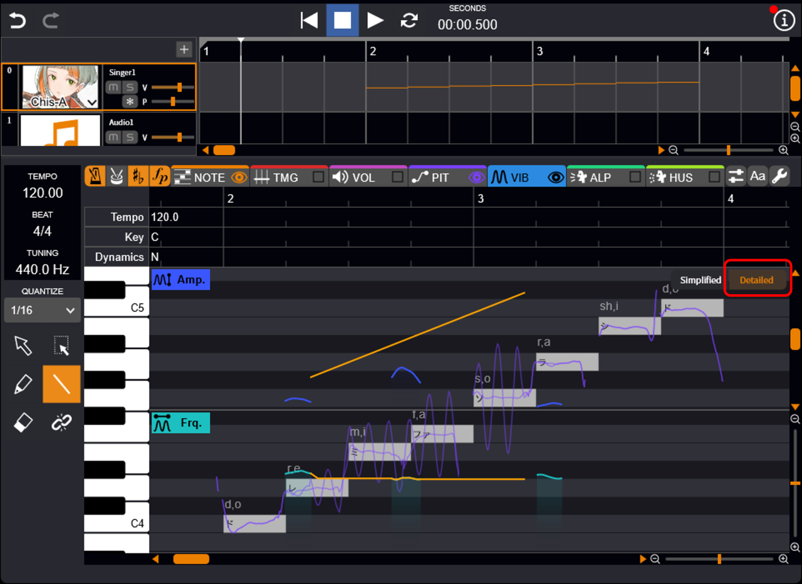

---

### 批量选择音符和参数

使用「批量选择工具」可以同时选择音符和参数。

这样就可以批量进行移动、复制、删除等操作。

1. 选择「批量选择工具」。
2. 左右拖动，使音符和参数包含在选中范围内。
   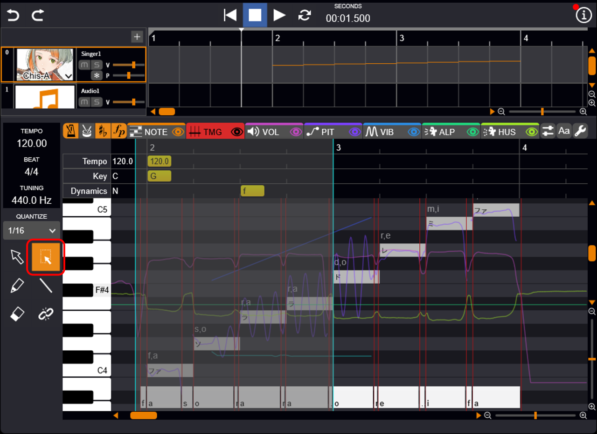
