原文：<https://manual.voisona.com/ja/song/pc/2b6e9bc7efb180d7bc2dd6c8e40ae93d>

---

# 编辑乐谱

在 VoiSona 中，基本的乐谱编辑可以轻松完成。此外，通过设置强弱记号、演奏法和歌唱表现，可以实现更丰富的表现力。

## 编辑音符

以下介绍编辑音符的各种操作。

### 输入音符

按照以下步骤输入音符。

1. 选择「钢笔工具」或「线条工具」。
2. 在钢琴卷帘上点击或左右拖动。
   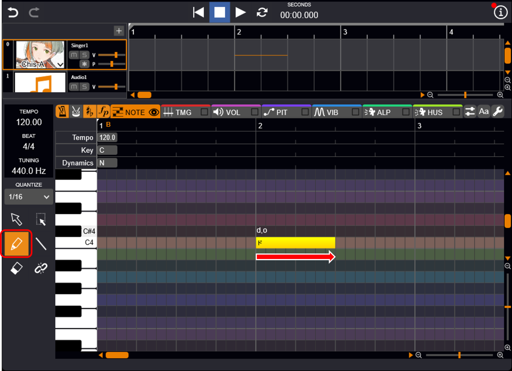

!!! info
      当存在多个歌曲轨道时，其他轨道的音符位置也会显示在钢琴卷帘上。
      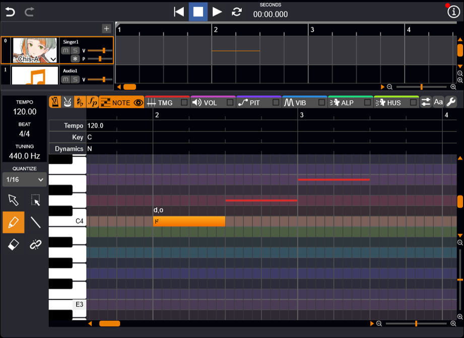

---

#### 更改音符量化设置

从下拉列表中，可以更改音符的量化设置（用于对齐音符输入位置的网格设置）。

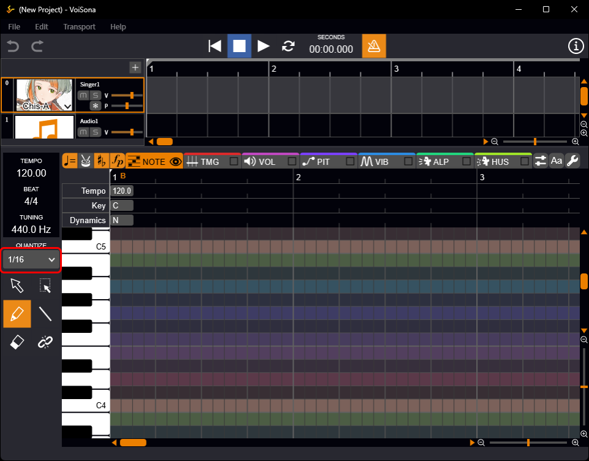

!!! info
      选中音符后右键点击选择「量化」，可将已输入的音符按照当前量化设置进行整理。

---

### 选择音符

按照以下步骤选择音符。

1. 选择「选择工具」。
2. 点击音符。
   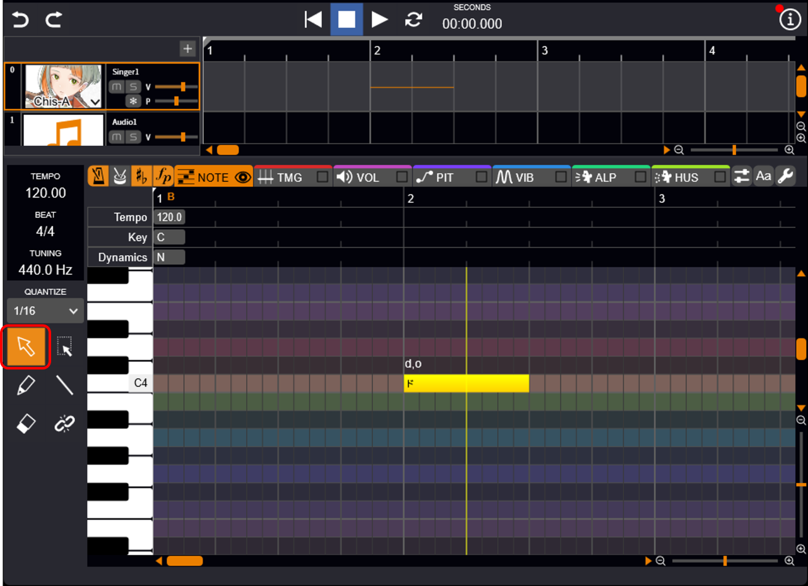

!!! info
      按 <kbd>Esc</kbd> 键可取消音符的选择。

!!! info
      当输入了多个音符时，按 <kbd>Home</kbd> 键可选择第一个音符，按 <kbd>End</kbd> 键可选择最后一个音符。

---

#### 选择多个音符

以下方法可选择多个音符。选中的音符可以批量进行移动、复制、删除等操作。

- 拖动包围多个音符：批量选择多个音符
- <kbd>Ctrl</kbd> + 点击：逐个选择多个音符
- <kbd>Shift</kbd> + 点击：连续选择多个音符
- <kbd>Shift</kbd> + 左右方向键：逐个选择连续音符
- 点击音符 → <kbd>Shift</kbd> + <kbd>Home</kbd>：选择点击音符之前的所有音符
- 点击音符 → <kbd>Shift</kbd> + <kbd>End</kbd>：选择点击音符之后的所有音符

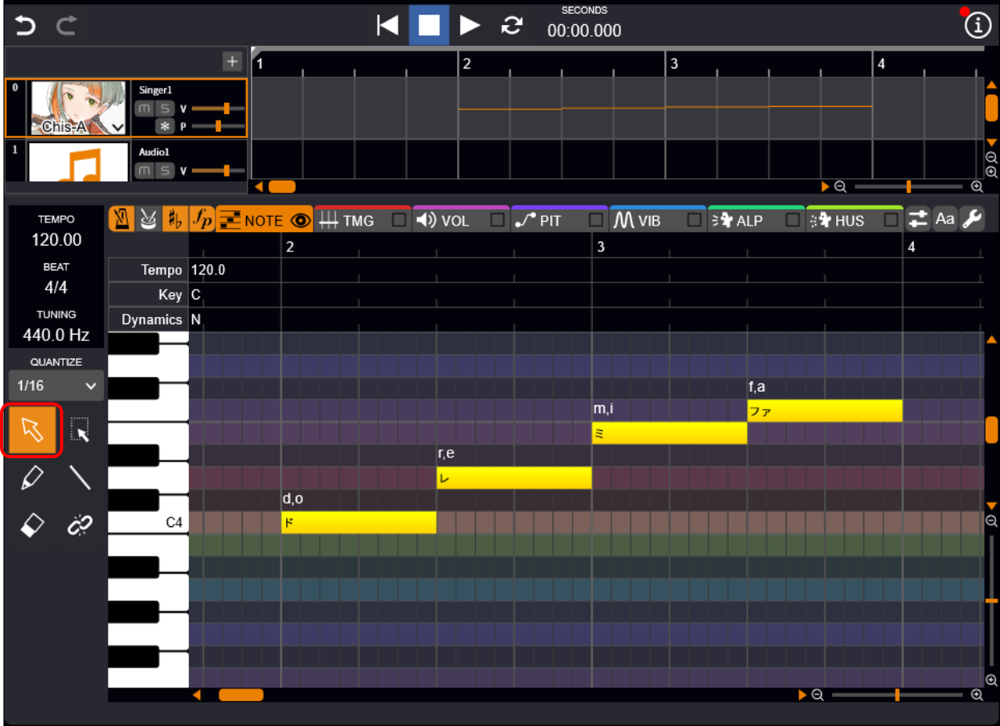

---

### 更改音符长度

输入音符后，可以更改音符的长度。

1. 选择「选择工具」「钢笔工具」「线条工具」之一。
2. 将光标对准音符的一端，光标变为箭头形状后，左右拖动。
   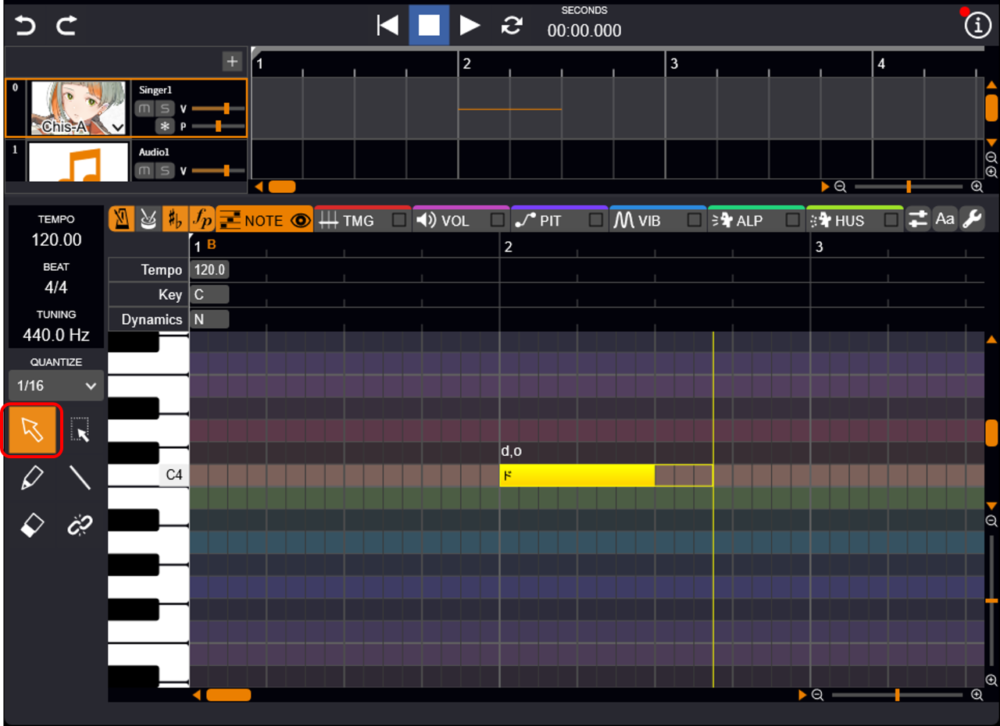

---

### 移动音符

移动音符，可以调整音高和发声时机。

1. 选择「选择工具」「钢笔工具」「线条工具」之一。
2. 将光标对准音符，光标变为手形后，拖动到目标位置。
   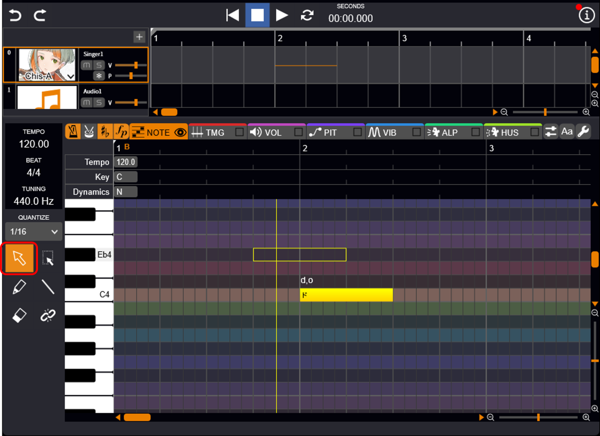

---

### 删除音符

按照以下步骤删除音符。

1. 选择「橡皮擦工具」。
2. 点击音符。
   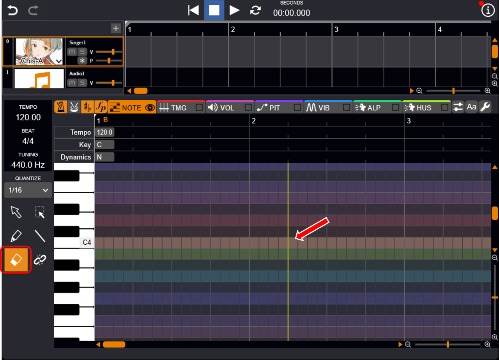

---

### 分割音符

一个音符可以分割成多个音符。

1. 选择「分割合并工具」。
2. 将光标对准音符，光标变为剪刀形状后，在想要分割的位置点击。
   

---

### 合并音符

前后音符可以合并为一个音符。

1. 选择「分割合并工具」。
2. 将光标对准音符的端部，光标变为绑定形状后点击。
   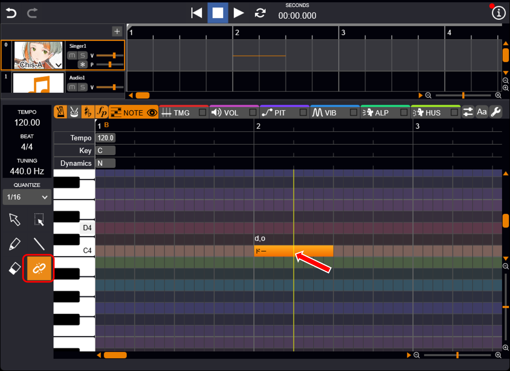

---

### 使用 <kbd>Ctrl</kbd> 键切换工具

按住 <kbd>Ctrl</kbd> 键可以临时切换当前工具，免去选择工具的麻烦。

1. 选择任意工具。
   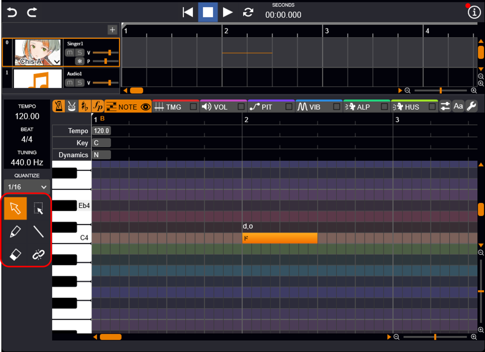
2. 按住 <kbd>Ctrl</kbd> 键。按住期间当前工具会按以下方式切换：
    - 「钢笔工具」「线条工具」→「橡皮擦工具」
    - 「橡皮擦工具」→「选择工具」
    - 「选择工具」「批量选择工具」「分割合并工具」→「钢笔工具」

---

## 编辑歌词

以下介绍编辑歌词的各种操作。

### 输入歌词

可以直接在音符上输入歌词。

1. 选择「选择工具」「批量选择工具」「钢笔工具」「线条工具」之一。
2. 双击音符。
3. 输入歌词并确认。
   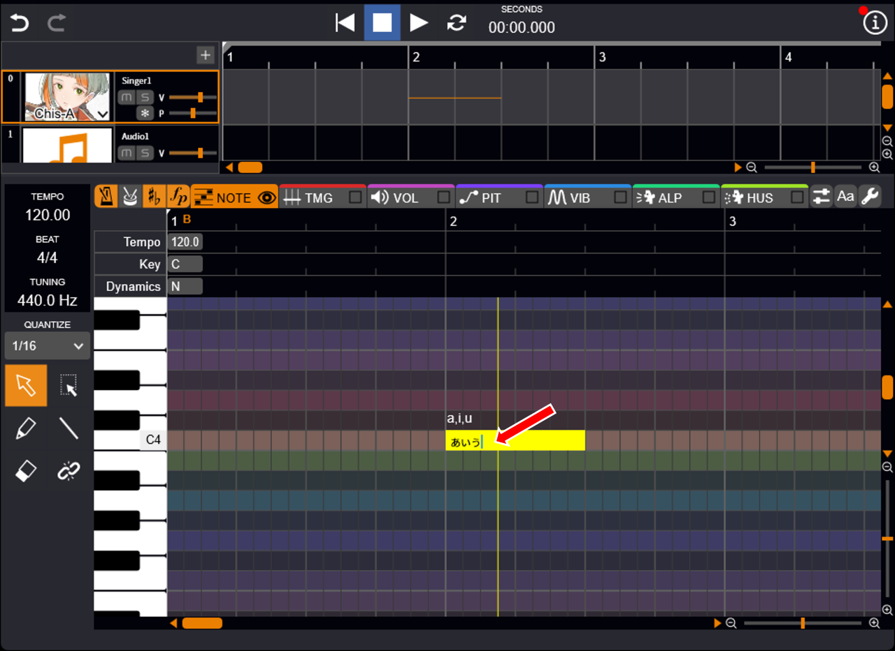

!!! info
      输入中，按 <kbd>Tab</kbd> 键移动到下一个音符，按 <kbd>Shift</kbd> + <kbd>Tab</kbd> 键移动到上一个音符。

!!! info
      在歌词中间输入空格，空格后的歌词将被分配到下一个音符。

---

#### 省略元音（日语）

在歌词末尾添加全角撇号（'），可以省略元音。  
例如歌词「いぇす」发音为「y, e, s, u」，而「いぇす'」发音为「y, e, s」，/u/ 会被省略。

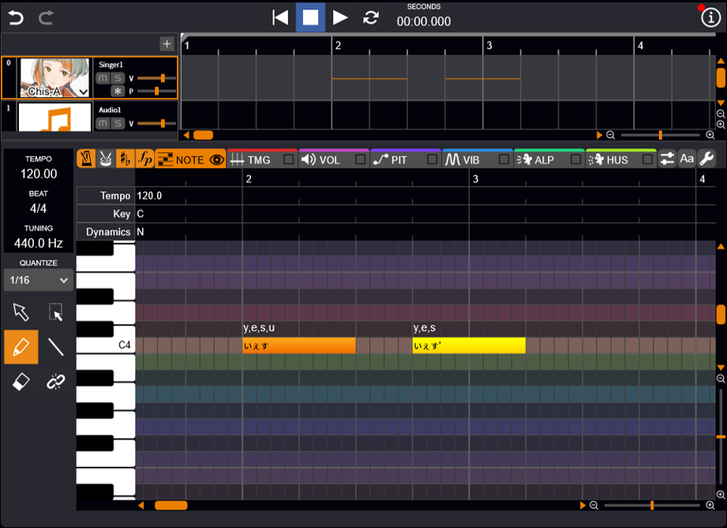

!!! info
      一个音符至少需要一个元音。例如，仅「す'」一个音符时，元音不会被省略。

---

#### 将英语歌词分配到多个音符（日语、英语）

一个英文单词可以分配到多个音符。准备所需数量的音符，分别输入歌词，并在后续音符前面加上连字符（-）。  
这样即使在多个音符间也会被识别为一个单词，发出自然的发音。  
例如，在两个音符中输入「li」和「-ke」，会作为单词「like」发音。

!!! info
      此外，在钢琴卷帘上右键点击开启「英文歌词自动分割」，英文歌词会自动按音节分割并分配到音符。

---

#### 设置声调（中文）

中文歌词可以以简体字、繁体字、拼音、注音输入。  
使用拼音或注音输入时，需要按以下方式设置声调：

- 拼音：在拼音后面附加「0」～「4」的数字
- 注音：在注音后面附加声调符号「˙」「ˉ」「ˊ」「ˇ」「ˋ」（轻声「˙」也可放在注音前面）

!!! warning
      不能使用 mā、méi、hǎo、huì 这类在字母上方标有声调符号的拼音写法。

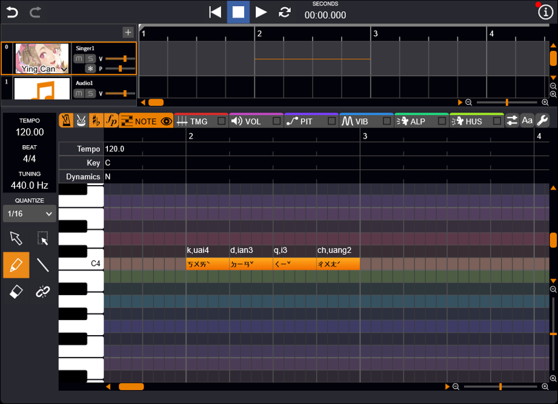

---

### 批量输入歌词

可以一次性输入多个音符的歌词。

!!! info
      选中音符的状态下，从该音符开始输入歌词。未选中音符的状态下，从第一个音符开始输入歌词。

1. 点击「批量输入歌词」按钮，显示面板。
2. 输入歌词。
   > 对于支持多语言演唱的声库，请从下拉列表中选择所需的语言。
3. 通过单选按钮设置歌词分配方式：
    - 空格分隔：以空格分隔的块作为一个音符分配
    - 1音符1字 或 1音符1音节：每个音符分配1个字（日语）或每个音符分配1个音节（英语、中文）
4. 点击「更新」。
   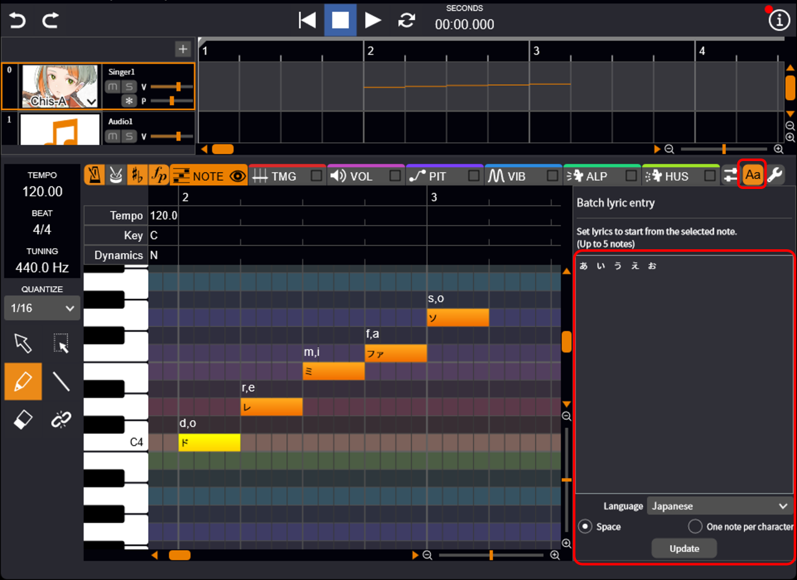
   歌词被输入到音符中。
   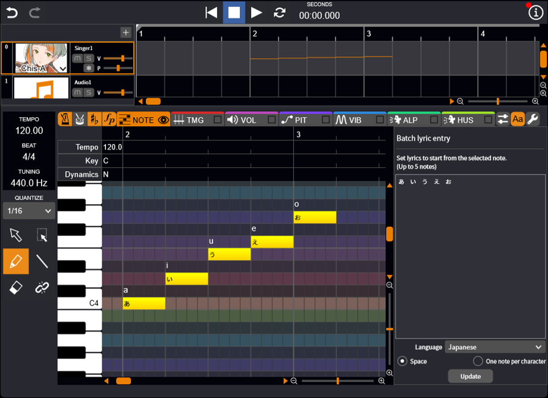

---

### 编辑歌词的音素序列

直接编辑音素序列，可以精细调整所输入歌词的发音。

1. 选择「选择工具」「批量选择工具」之一。
2. 双击显示音素序列的位置。
3. 通过点击音素面板或键盘输入来编辑音素序列。
   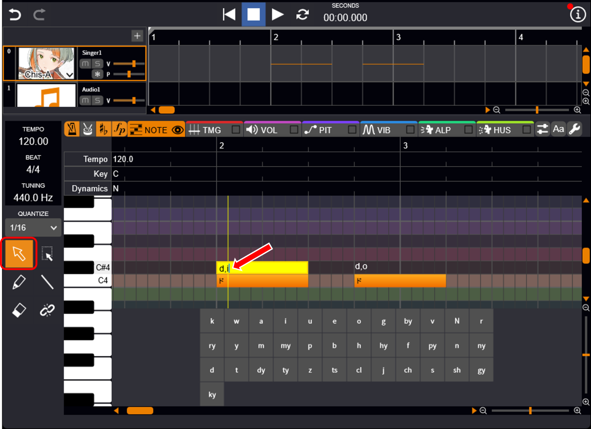
4. 点击钢琴卷帘确认。音素序列将以绿色显示。
   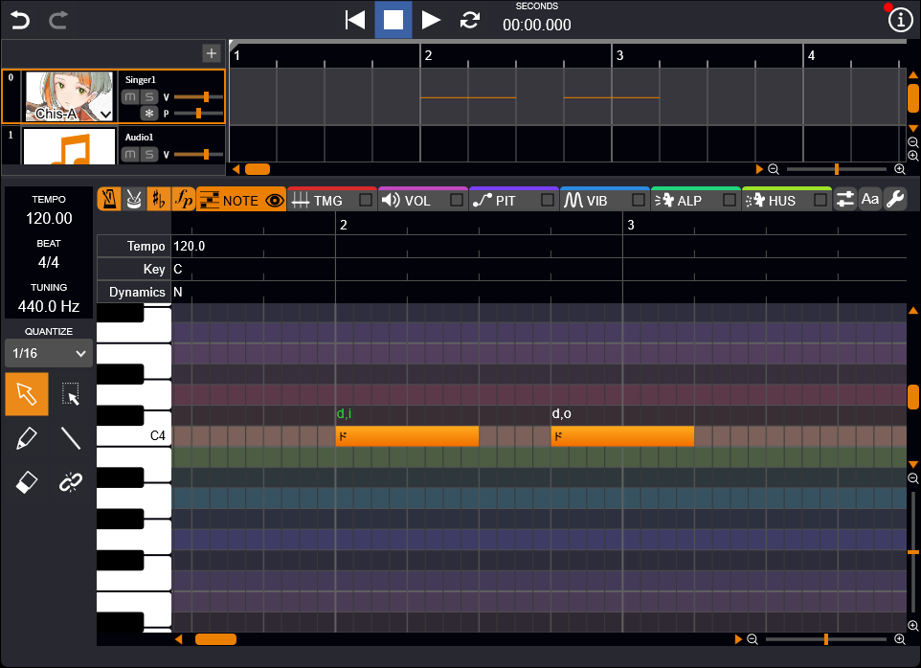

---

#### 日语音素

日语音素请参阅官方手册中的音素表。

---

#### 英语音素（英语歌声库专用）

英语音素及其对应的 IPA 符号，请参阅官方手册中的对照表。

英文单词的重音（强调部分）可以在元音后添加符号来表示。不过，歌声中指定重音后合成的声音往往差异不大。

- 主重音（发音最强的部分）：`*~`
- 次重音（发音较强的部分）：`*`

!!! info
      在使用日语音库输入英文歌词时，会分配最接近的日语音素。请注意，日语音素不一定能恰当表现英语发音。

---

## 设置速度、拍号、调号与强弱记号

速度、拍号、调号、强弱记号可以通过在各行中添加符号来设置。

1. 点击「速度」「拍号」「调号」「强弱记号」按钮，切换添加符号行的显示或隐藏。
2. 在要添加符号的行上双击。
3. 选择要设置的项目（速度需输入数值）。符号将被添加并反映到乐谱中。
   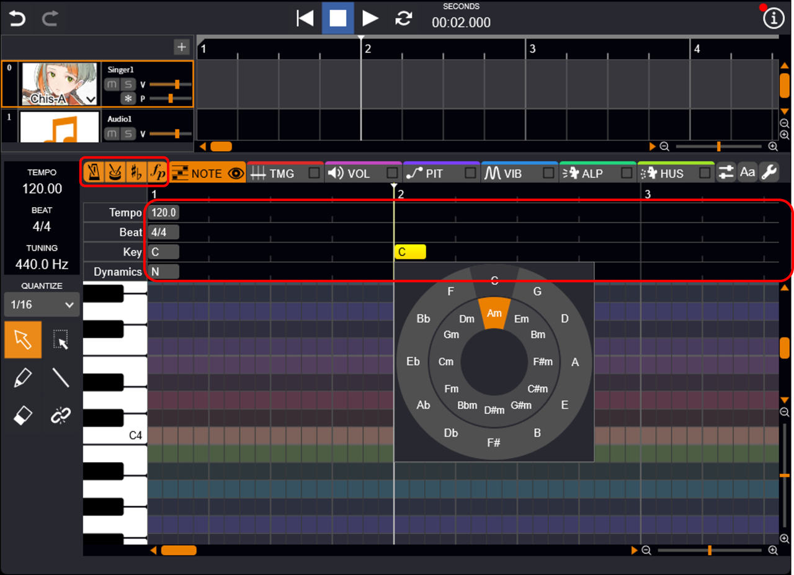
   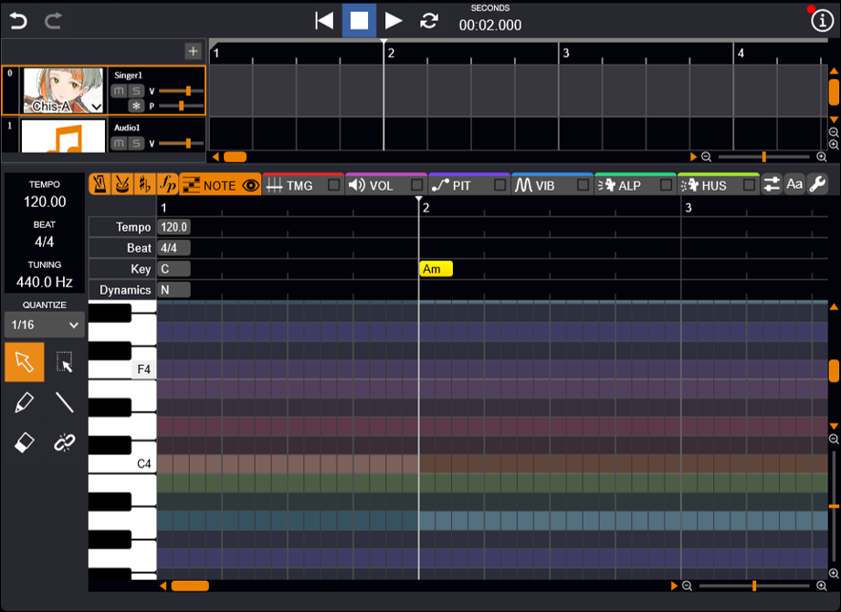

!!! info "设置要点"
      为获得良好的演唱效果，正确设置调号至关重要。

      此外，设置强弱记号可以增添歌声的表现力。
      
      但是，根据声库或乐谱的不同，强弱记号的效果可能难以表现出来。

---

## 更改属性

音符、速度、拍号、调号、强弱记号的各种属性都可以在面板上更改。

### 显示属性

按照以下步骤显示各属性，即可进行编辑。

1. 点击「属性」按钮，显示面板。
2. 选择音符、速度、拍号、调号或强弱记号之一。属性将显示在面板中。
   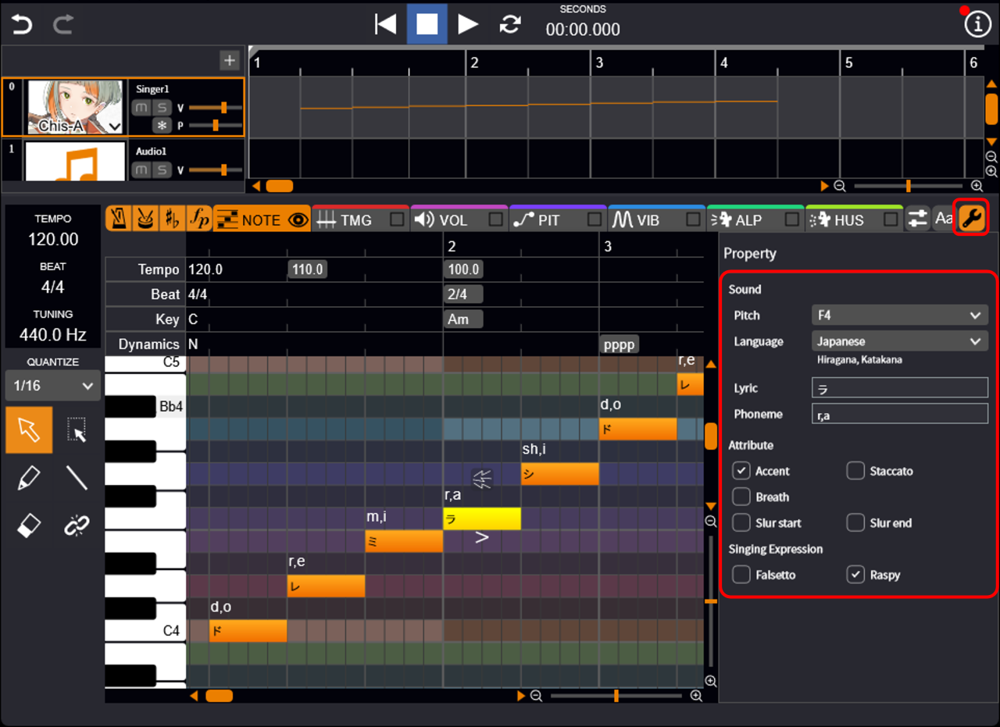
   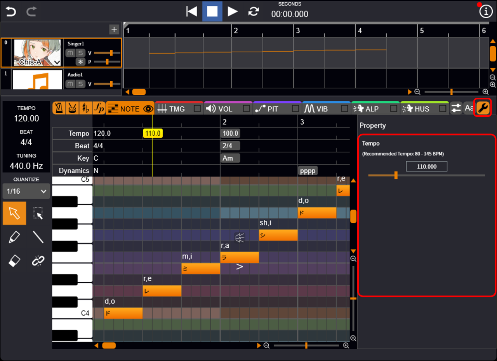

---

### 设置演奏法与连音线

通过设置演奏法（重音、断音、换气）和连音线，可以表现歌唱的细微差别。

1. 选择音符。
2. 在属性的「属性」中勾选想要设置的项目。音符上将显示相应符号。
   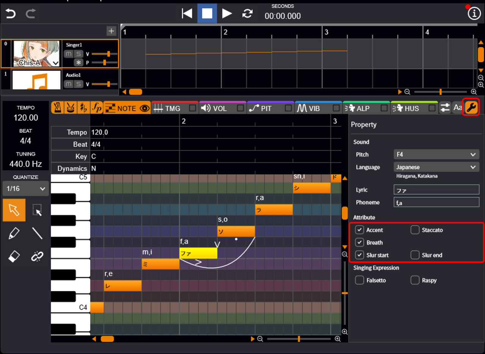

!!! info "设置要点"
      连音线在希望多个音符平滑连接演唱时效果显著。

      但是，根据声库或乐谱的不同，演奏法和连音线的效果可能难以表现出来。

---

### 设置歌唱表现

通过设置歌唱表现，可以再现每位声库提供者独具个性的歌唱风格。

1. 选择音符。
2. 在属性的「歌唱表现」中勾选想要设置的项目。音符上方将显示图标。
   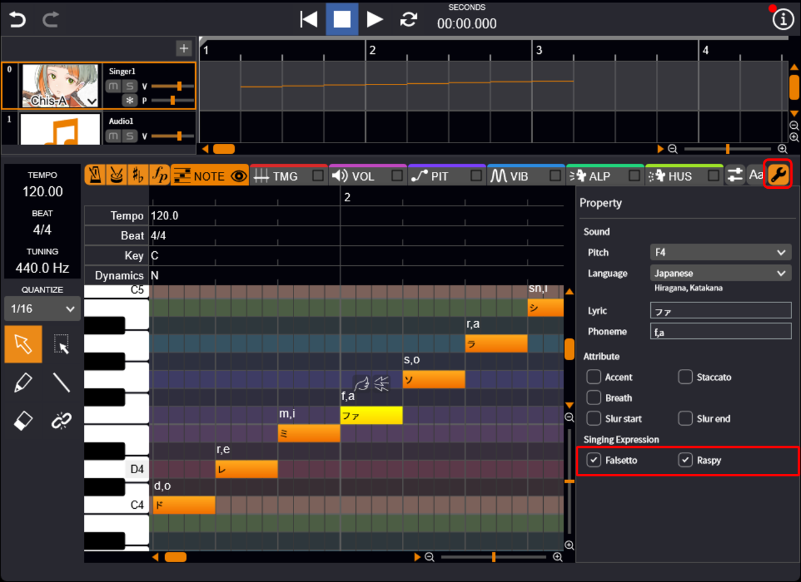

!!! info "关于歌唱表现的再现"
      VoiSona 中，声库提供者独特的歌唱表现也经过了 AI 学习，合成时可通过指定「歌唱表现」来再现。

      但是，根据声库版本、歌词、音高等不同因素，歌唱表现的明显程度有所不同，会有表现不出现的情况。

---

### 设置语言

在支持多语言歌唱的声库中，可以为每个音符设置语言，从而输入各语言对应的歌词。

1. 选择音符。
2. 在属性的「语言」中，从下拉列表中选择要设置的语言。设置后将可以输入对应语言的歌词。
   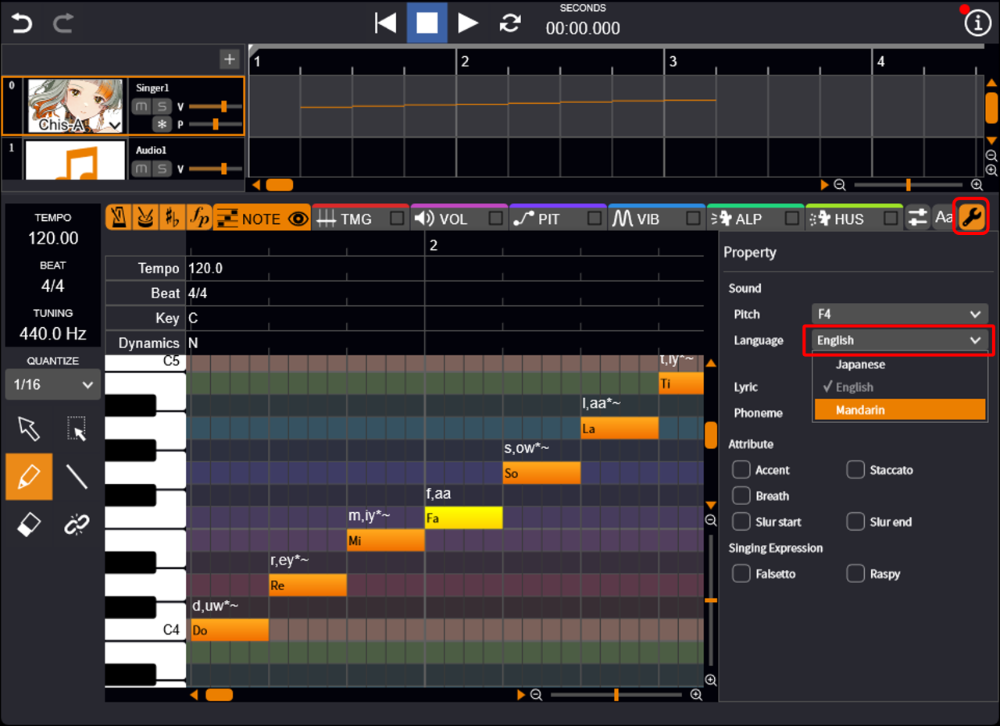

!!! info
      可用的歌词书写格式会显示在语言选择栏的下方。
      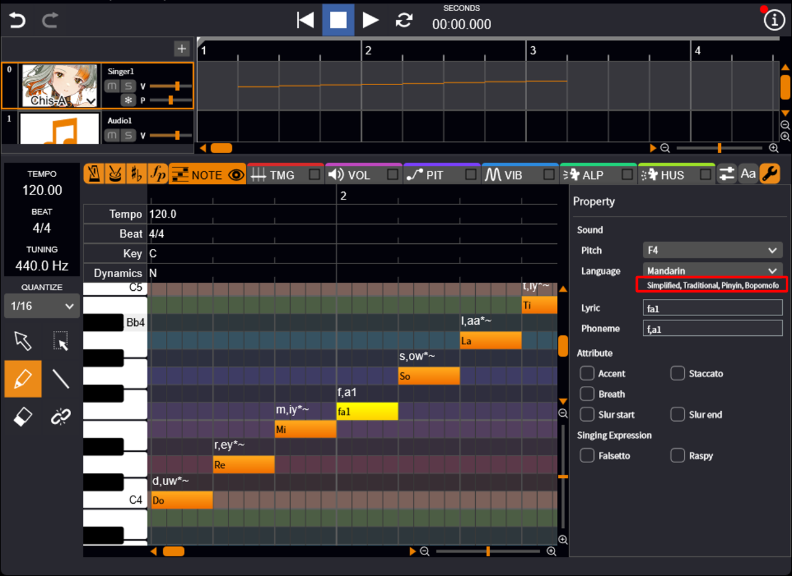

---

## 插入小节

可以在乐曲中间插入新的小节。

1. 在钢琴卷帘上方的标尺上，点击想要插入小节的位置。
2. 在钢琴卷帘上右键点击，选择「小节」>「插入1小节」或「插入小节」。
   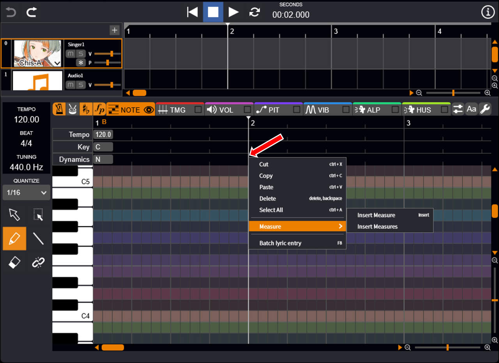
3. 选择「插入小节」时，指定小节数后点击「插入」。
   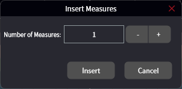
   指定位置将插入任意数量的小节。
   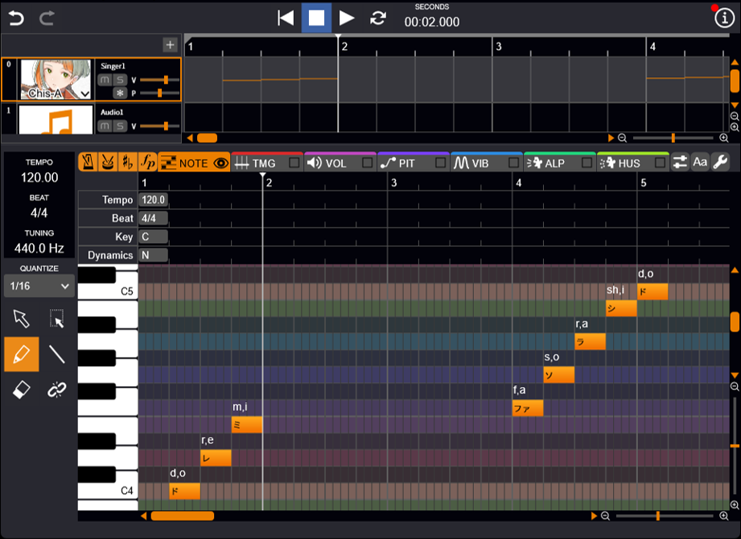

---

## 更改基准音高

更改基准音高后，轨道内所有音符的音高会根据指定值整体升高或降低。

1. 双击显示「440.0 Hz」的位置。
2. 直接输入数值或使用滑块调整，点击「更改」。数值将被更改。
   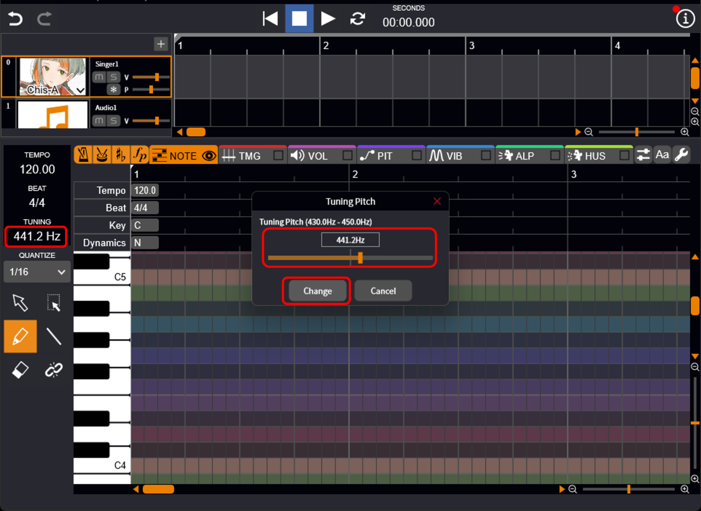

---

## 减轻播放负载（冻结轨道）

冻结轨道可以减轻播放时的负载，实现流畅播放。

1. 点击「冻结」按钮。合成处理开始。
   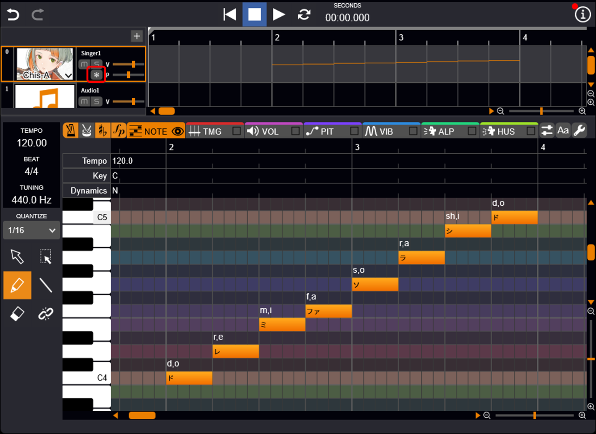
   处理完成后「冻结」按钮变为 ON，即可播放。
   

!!! info "关于冻结轨道功能"
      通常，语音合成处理在每次播放时实时进行，但根据设备性能，处理负载可能过高，导致播放断续。

      使用此功能可以提前合成音频，大幅减轻播放时的负载。

      特别是在使用多个轨道播放出现中断时，冻结正在编辑以外的轨道可能会使播放更加流畅。
