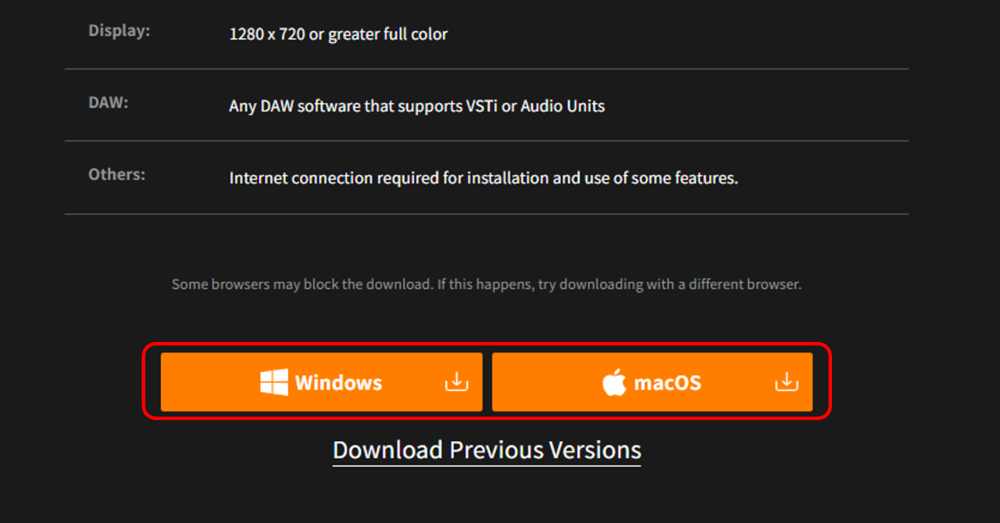
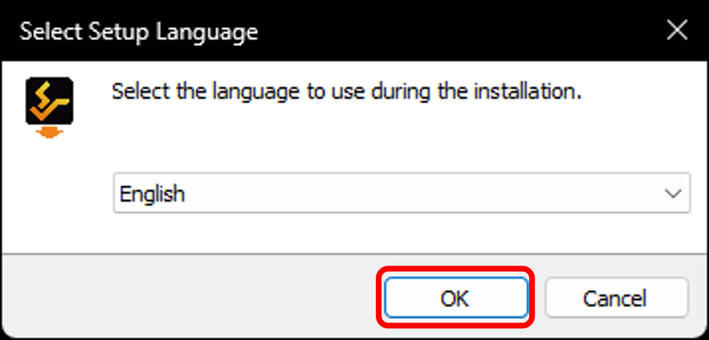
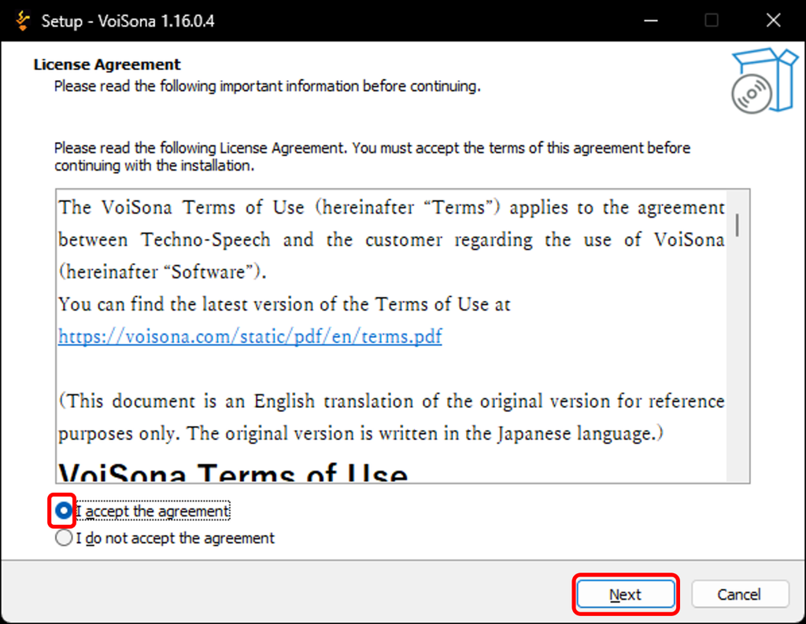
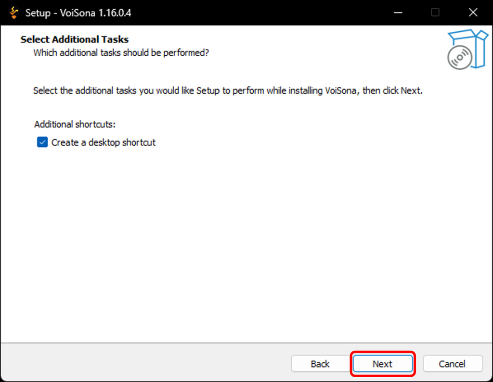
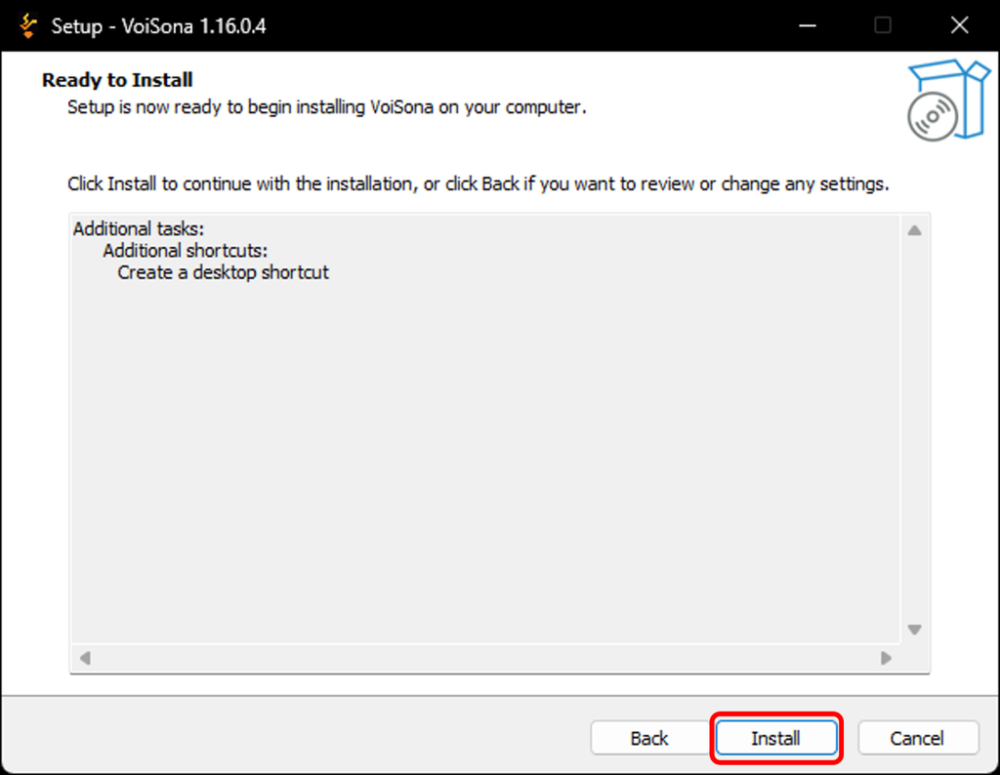
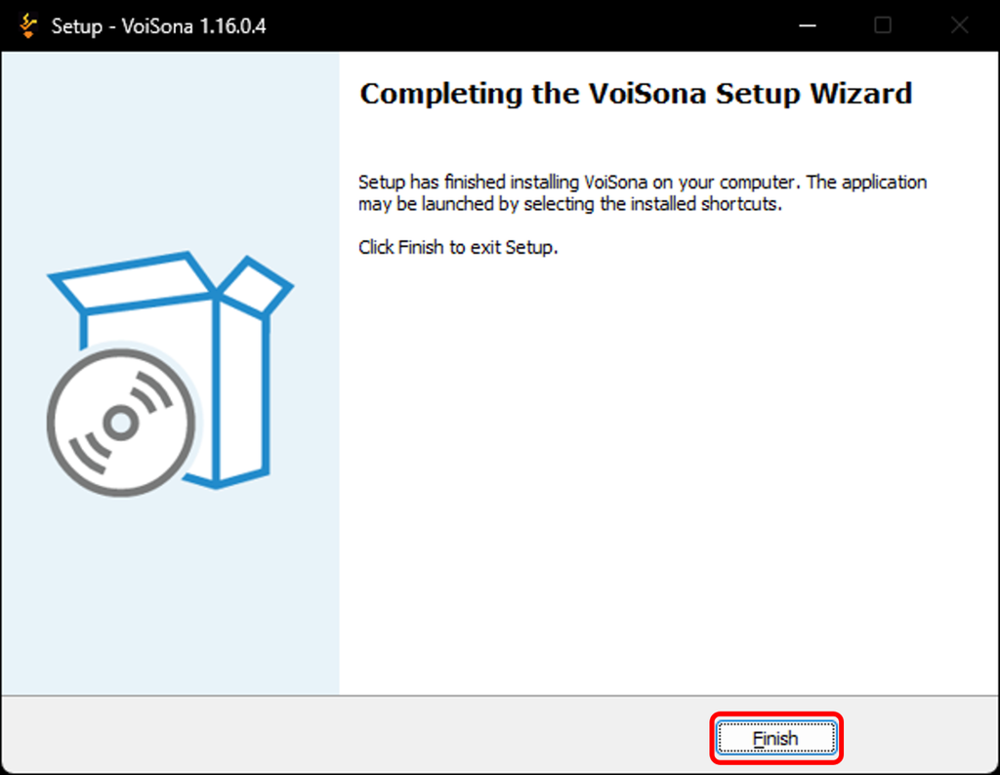

原文：[VoiSonaをインストールする](https://manual.voisona.com/ja/song/pc/294e9bc7efb180d18f29daa2d8ac833c)

---

# 安装 VoiSona

要使用 VoiSona，请先安装应用程序。更新时也可按照相同的步骤进行。

!!! warning
      请在电脑连接互联网的状态下进行操作。

1. 访问 DOWNLOAD 页面并登录。
2. 点击「Windows版」或「macOS版」按钮。
   
3. 最新版本的安装程序将被下载。
4. 打开下载的安装程序。
5. 选择安装过程中使用的语言，点击「OK」。
   
6. 确认使用许可协议后，如同意则勾选「同意」并点击「下一步」。
   
7. 如需要在桌面创建图标请勾选，然后点击「下一步」。
   
8. 点击「安装」。安装将开始。
   
9. 安装完成后，点击「完成」。
   

## 安装目标文件夹

| 类型 | Windows | macOS |
|------|---------|-------|
| 安装目录 | `C:\Program Files\Techno-Speech` | `/Users/<用户名>/Library/Techno-Speech` |
| 插件目录 (VST3) | `C:\Program Files\Common Files\vst3\Techno-Speech` | `/Library/Audio/Plug-Ins/VST3/Techno-Speech` |
| 插件目录 (AU) | — | `/Library/Audio/Plug-Ins/Components` |
| ARA 插件目录 | `C:\Program Files\Common Files\ARA` | `/Library/Audio/Plug-Ins/ARA` |
