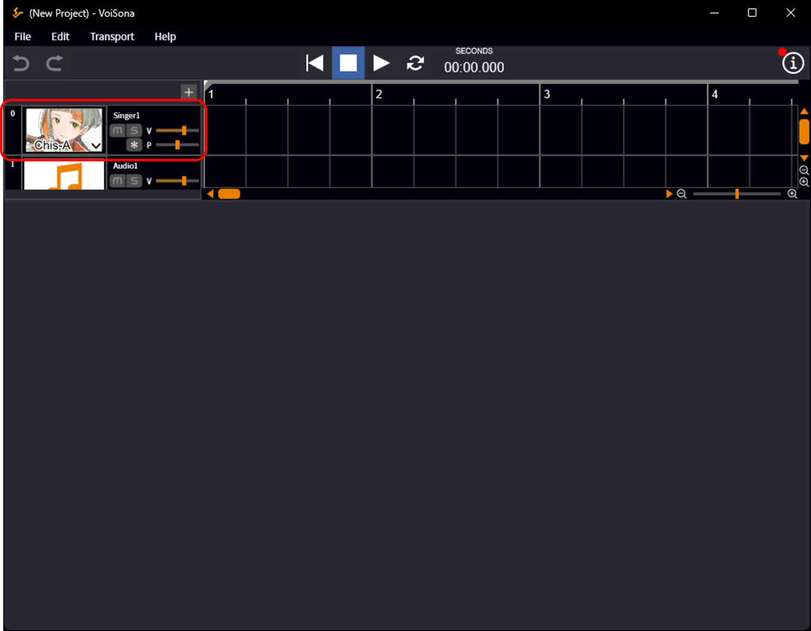
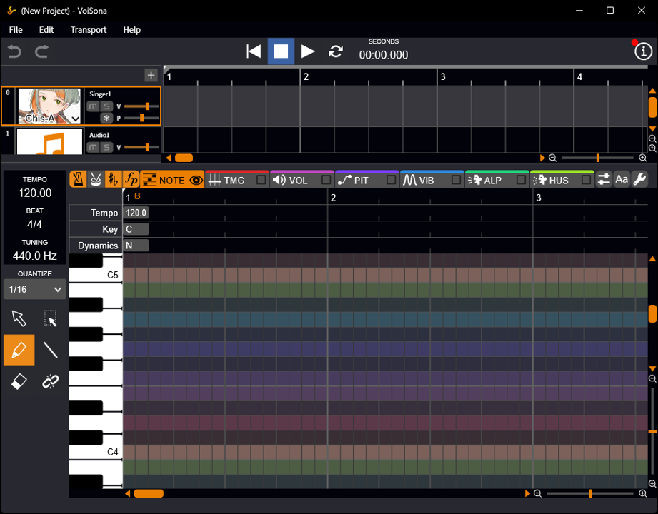
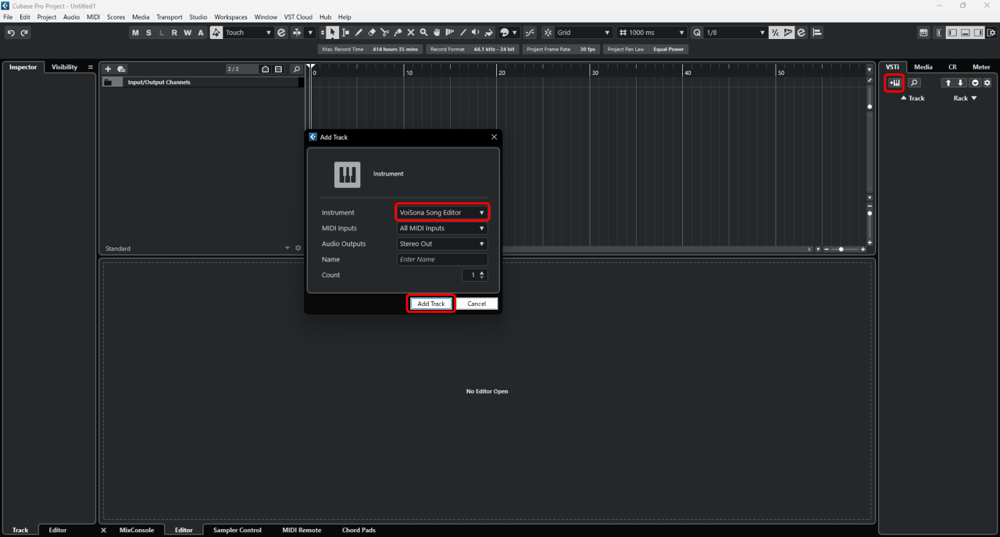
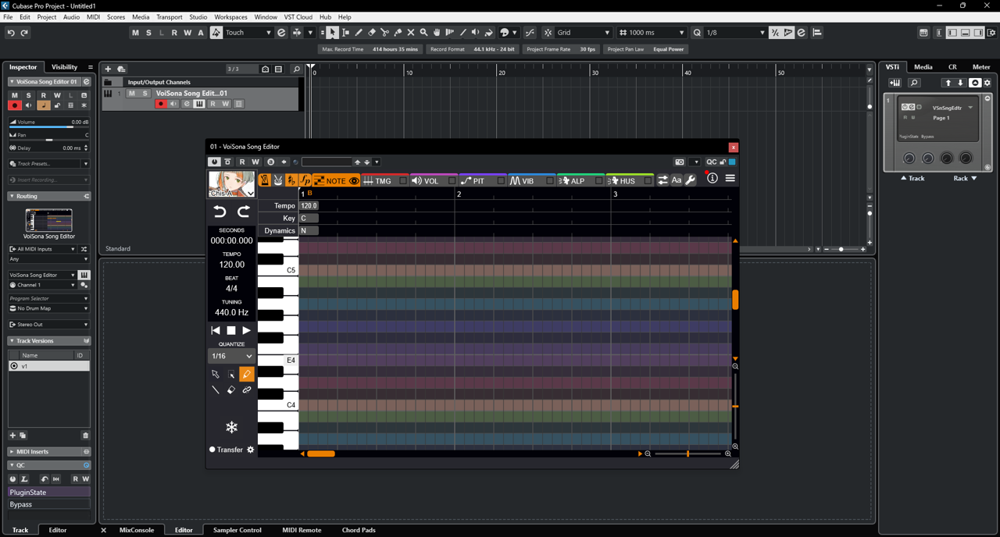
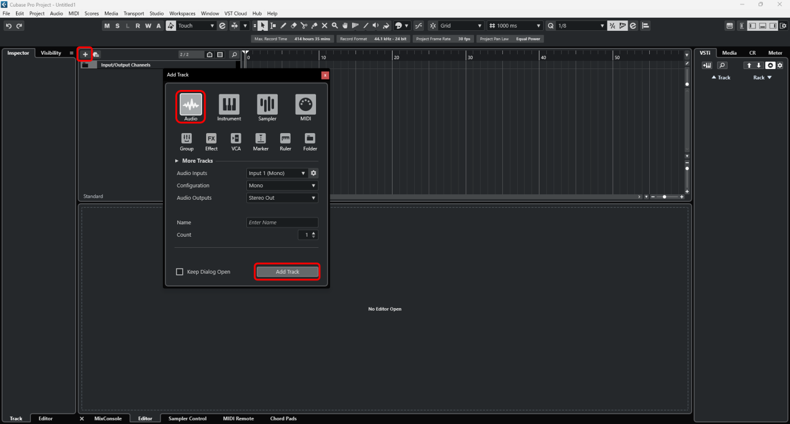
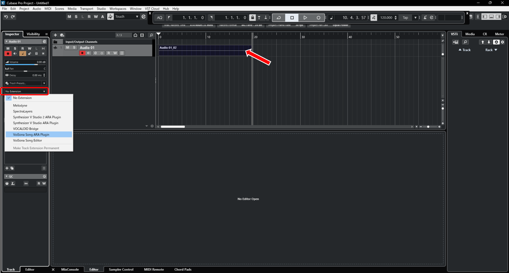
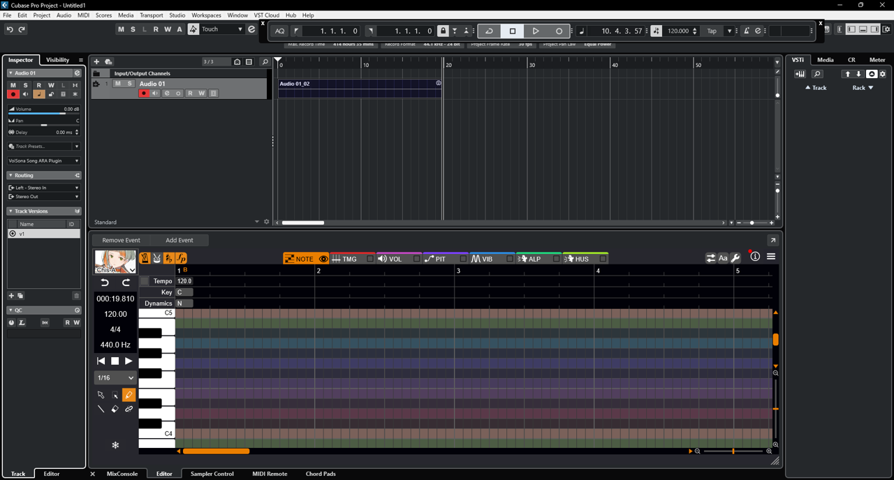
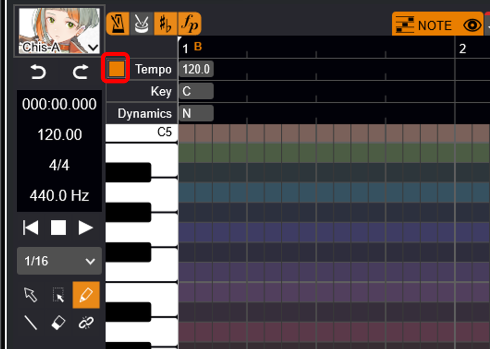

原文：[VoiSonaを起動する](https://manual.voisona.com/ja/song/pc/2a9e9bc7efb1809f8f42dff0a1889f99)

---

# 启动 VoiSona

VoiSona 可以通过以下三种方式使用。

!!! info
      首次启动时，请先完成登录以及声库的下载与选择。

## 独立运行（Standalone）

VoiSona 安装后即可立即启动使用。即使没有 DAW（数字音频工作站），也可以轻松使用。

1. 启动 VoiSona 应用程序。  
   新项目将被创建。
2. 选择歌曲轨道。  
   乐谱编辑画面将显示出来。
   
   

---

## 作为乐器插件使用

如果您拥有 DAW，可以将 VoiSona 作为 VST 或 Audio Units (AU) 的乐器插件使用。  
以「Cubase Pro 13」的 VST 乐器插件 (VSTi) 为例介绍使用方法。

1. 启动「Cubase Pro 13」。
2. 点击「添加轨道乐器」。
3. 选择「VoiSona Song Editor」并点击「添加轨道」。  
   VoiSona 的编辑画面将显示出来。
   
   

---

## 作为 ARA 插件使用

如果您拥有支持 ARA 的 DAW，可以将 VoiSona 作为 VST 或 Audio Units 的 ARA 插件使用。  
以「Cubase Pro 13」的 ARA 插件为例介绍使用方法。

1. 启动「Cubase Pro 13」。
2. 点击「+（添加轨道）」。
3. 选择「Audio」并点击「添加轨道」。
   
4. 将音频文件拖放到添加的轨道上，或通过录音设置音频。
5. 点击「Inspector」>「轨道」标签页中的「无扩展」。
6. 选择「VoiSona Song ARA Plugin」。  
   VoiSona 的编辑画面将显示出来。
   
   

!!! warning
      作为 ARA 插件使用时，插件的输入音频轨道需要设置足够长度的音频。

      部分 DAW 在未设置音频的部分不会输出声音，请注意。

!!! info
      在 ARA 插件中，您可以选择在 VoiSona 编辑画面中编辑速度，还是跟随 DAW 侧的设置。

      切换时请点击 Tempo 左侧的方框。
      
