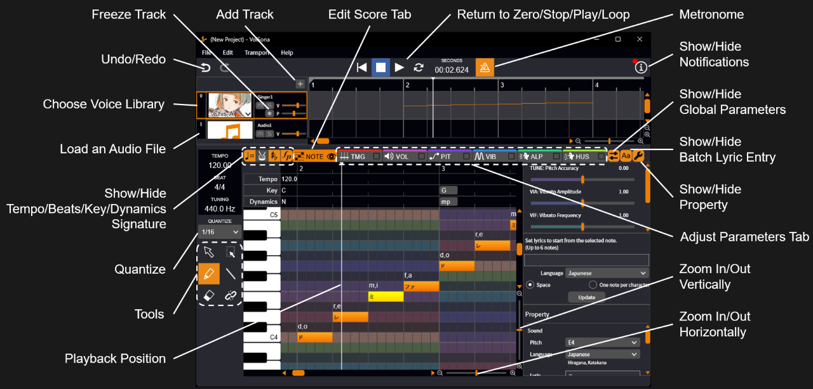

原文：[VoiSonaの使い方を知ろう。](https://manual.voisona.com/ja/song/pc)

---

# 学习 VoiSona 的使用方法。

## 目录

1. [快速入门指南](quickstart.md)
2. [安装 VoiSona](install.md)
3. [启动 VoiSona](launch.md)
4. [登录](login.md)
5. [选择声库](select-voice.md)
6. [编辑乐谱](edit-score.md)
7. [调整参数](adjust-params.md)
8. [导入与导出文件](import-export.md)
9. [更改环境设置](settings.md)
10. [常见问题](faq.md)
