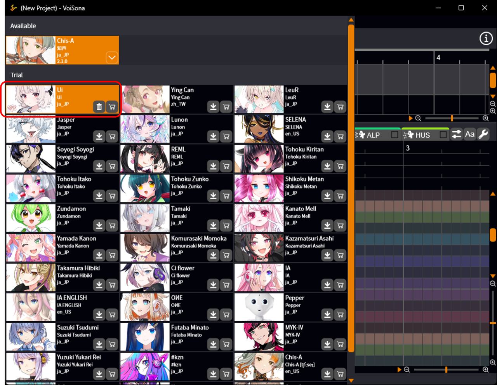
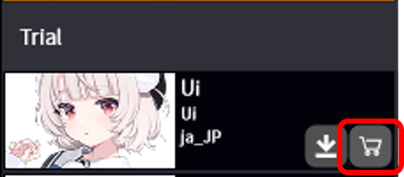
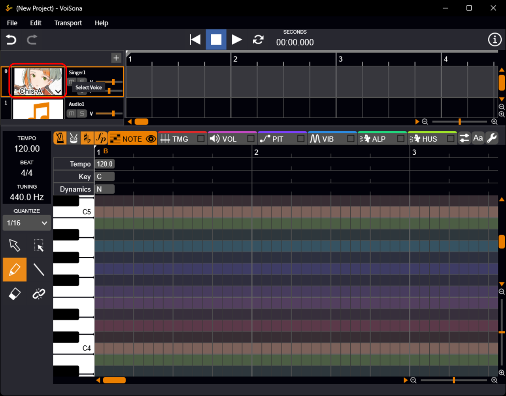
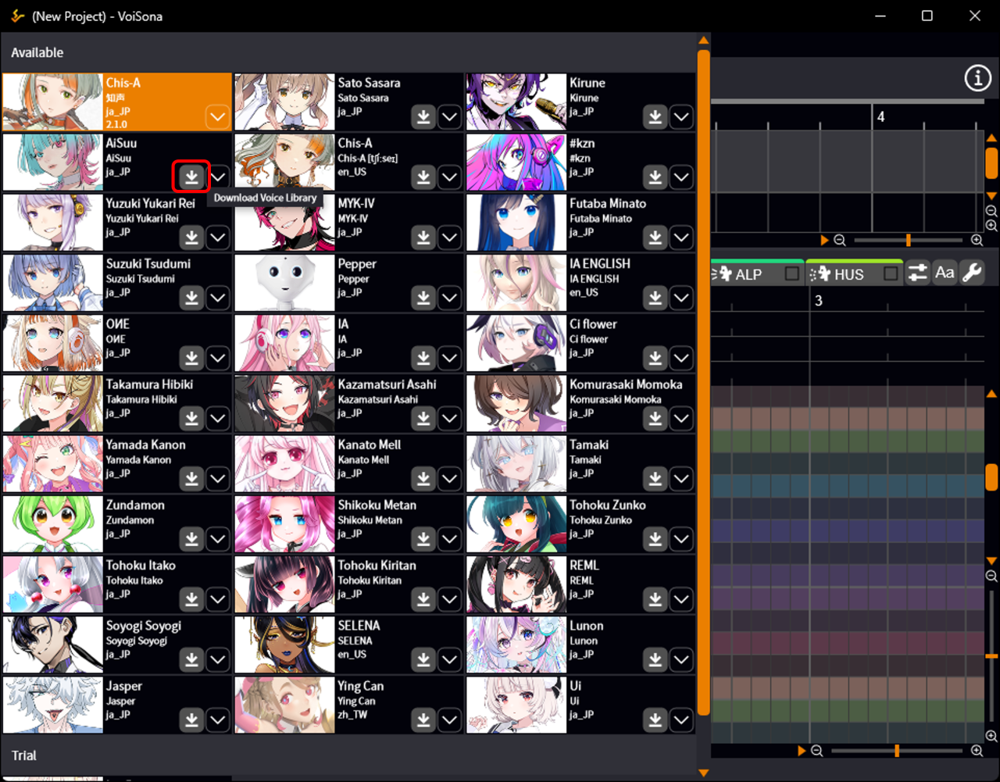
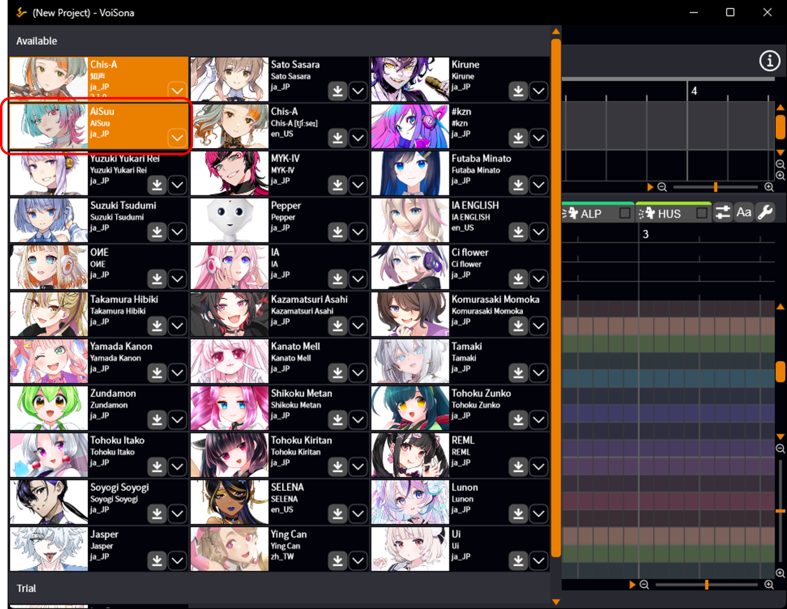
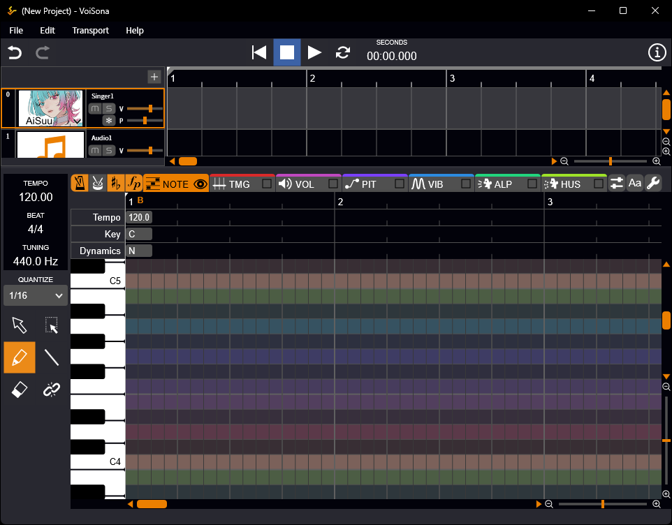
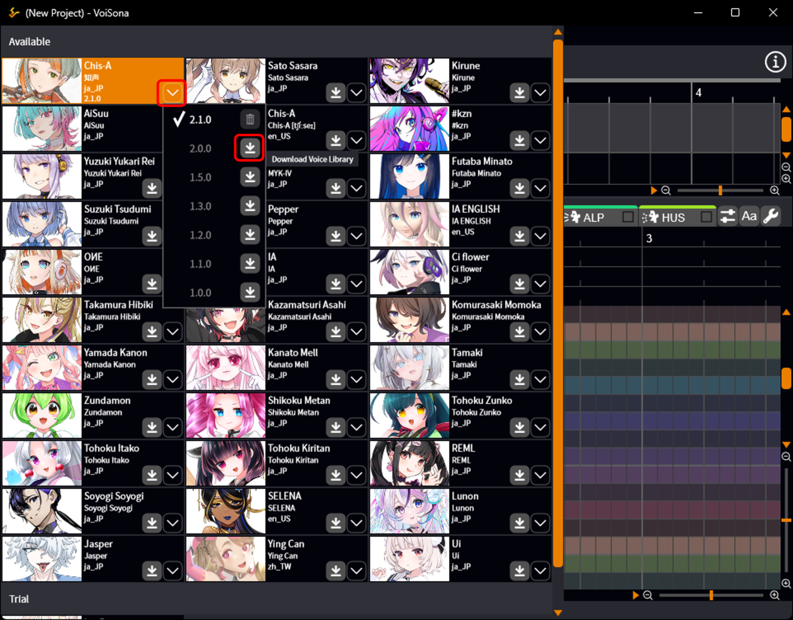
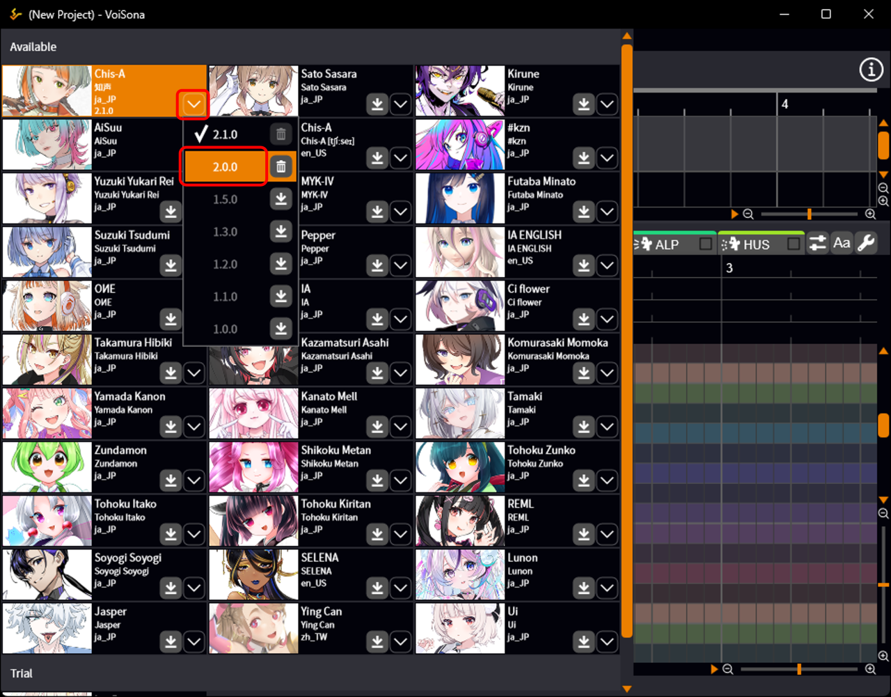
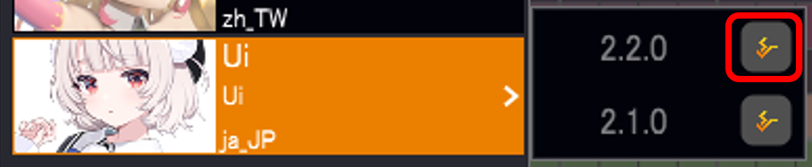
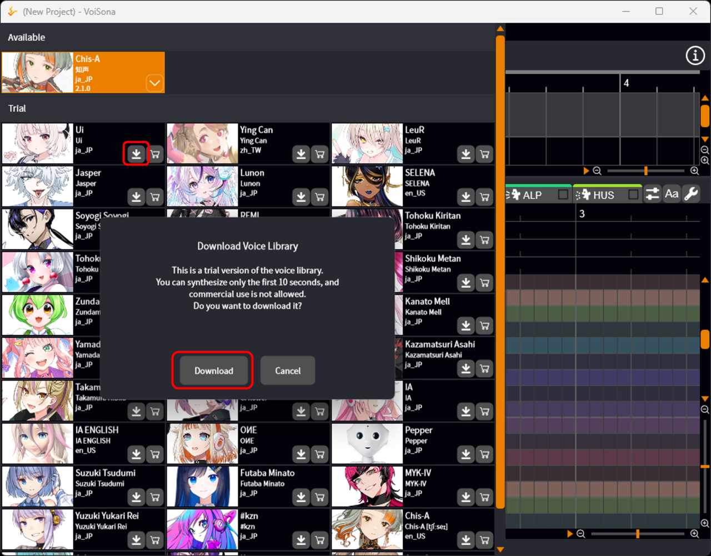

原文：[ボイスライブラリを選択する](https://manual.voisona.com/ja/song/pc/2b6e9bc7efb180ffbaa1ef0b86cc58ef)

---

# 选择声库

您可以从声库中选择歌曲所用的歌声。

## 添加声库

请按照以下步骤添加声库。

1. 访问 [ARTIST](https://voisona.com/song/artist/) 页面，购买许可证。

    !!! info
        您也可以通过「可试用」声库中的「前往购买页面」访问。
        

2. 重新启动 VoiSona 应用程序。

    !!! info
          当您使用许可证[登录](login.md#_1)您的帐户时，它将自动添加到语音库列表中。

3. 下载并选择声库。

---

## 下载并选择声库

您可以从已购买的声库中选择喜欢的版本使用。

### 使用最新版本

请按照以下步骤使用所需声库的最新版本。

1. 点击「选择声音」。
   
2. 点击所需声库的「下载声库」按钮。  
   此时将开始下载声库。  
   
3. 选择声库。  
   此时将显示乐谱编辑画面，并显示所选声库的图片。
   
   

---

### 使用过往版本

请按照以下步骤使用所需声库的过往版本。

1. 点击「选择声音」。
2. 点击「选择声音版本」按钮。
3. 点击所需版本的「下载声库」按钮。  
   此时将开始下载声库。  
   下载完成后，版本选择画面将关闭。
   
4. 再次点击「选择声音版本」按钮打开选择画面，点击版本号。  
   此时将显示乐谱编辑画面，并显示所选声库的图片。
   

!!! info "如果「下载声库」按钮没有显示出来"
      请点击显示的按钮前往 DOWNLOAD 页面，将 VoiSona 更新到最新版本。更新后，重新启动 VoiSona，就会显示「下载声库」按钮。
      
      请注意，如果运行的 VoiSona 版本因过旧而不支持对应的声库，则不会显示「下载声库」按钮。
      
      

---

## 试用声库

未购买的声库也可以以试用为目的使用最多 10 秒。

!!! info
      部分声库除外。

!!! warning
      试用时不能使用导出功能。

1. 登录。
2. 点击「选择声音」。
3. 点击「可试用」区域中显示的声音的「下载声库」按钮。
4. 确认对话框中的消息后，点击「下载」。  
   此时将开始下载声库。
   
5. 选择声库。  
   此时将显示乐谱编辑画面，并显示所选声库的图片。
   
