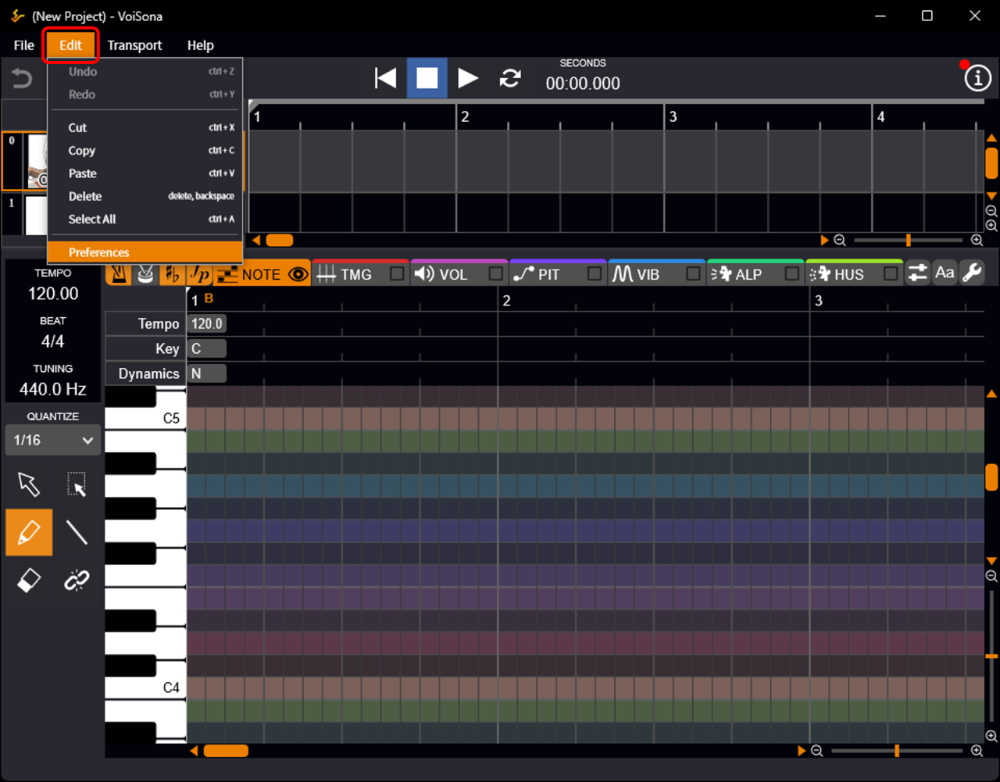
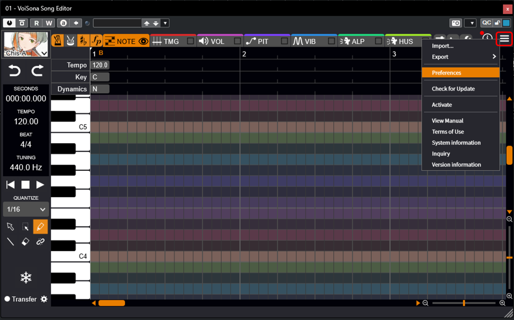
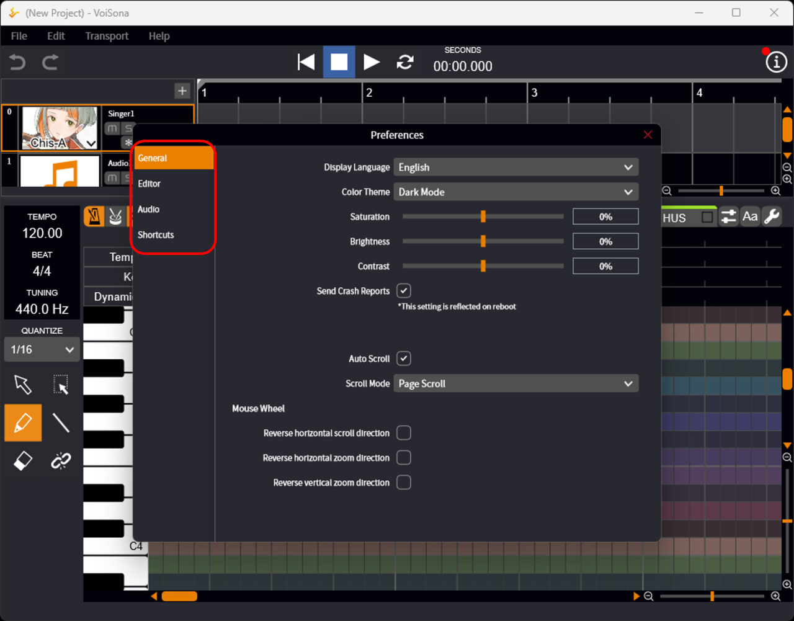
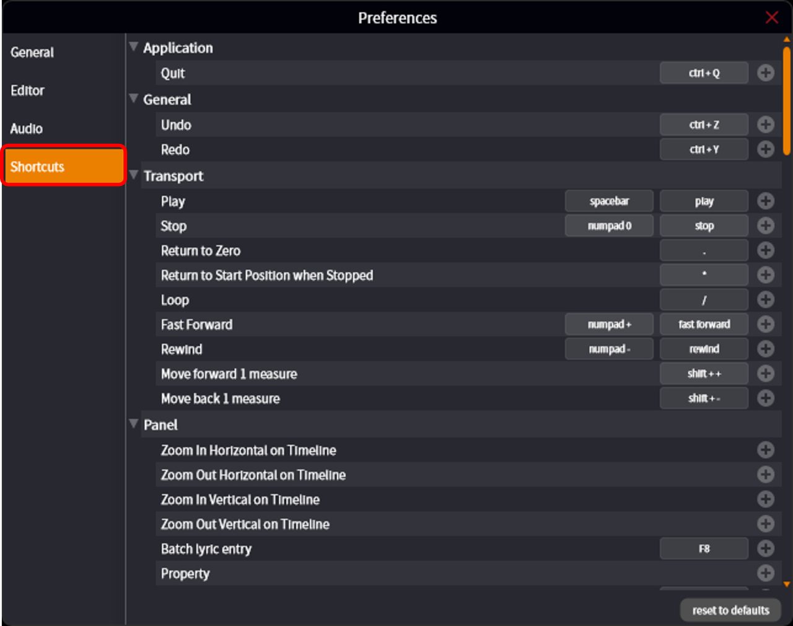

原文：<https://manual.voisona.com/ja/song/pc/2b6e9bc7efb180edbe15debe5788de33>

---

# 更改环境设置

可以更改语言设置、编辑器整体行为以及快捷键分配等。

1. 选择以下操作之一：
    - 独立应用：菜单栏的「编辑」>「环境设置」
    - 乐器插件、ARA 插件：点击「菜单」按钮后选择「环境设置」
      
      
2. 切换左侧标签页，进行各种设置。
   

!!! info
      在「快捷键」设置画面中，可以自由更改各操作分配的按键。

      善用快捷键可以大幅提高工作效率，请务必利用。
      
