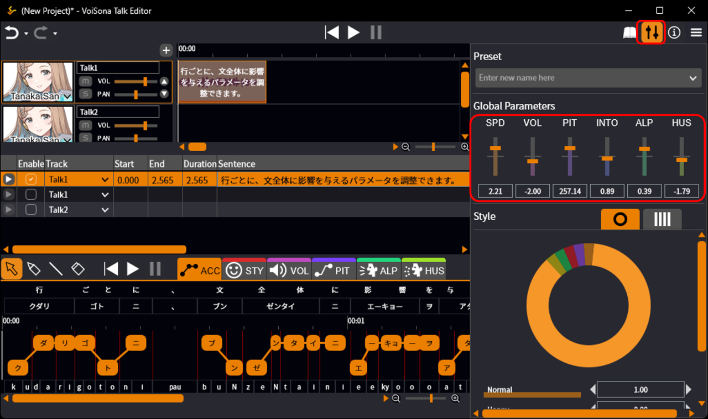
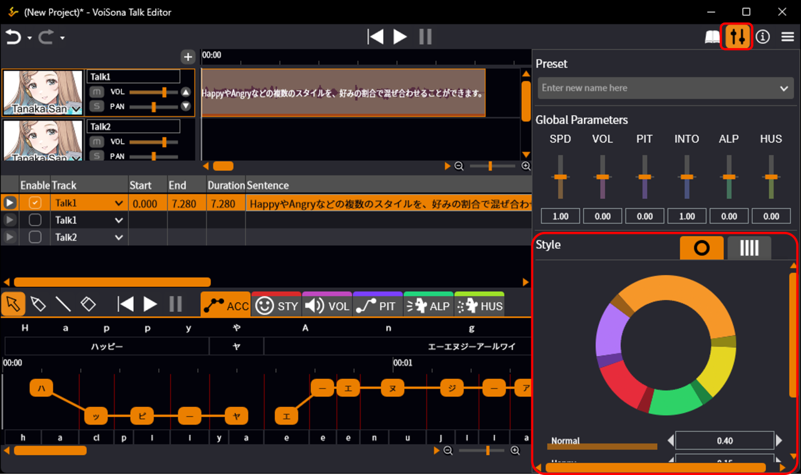
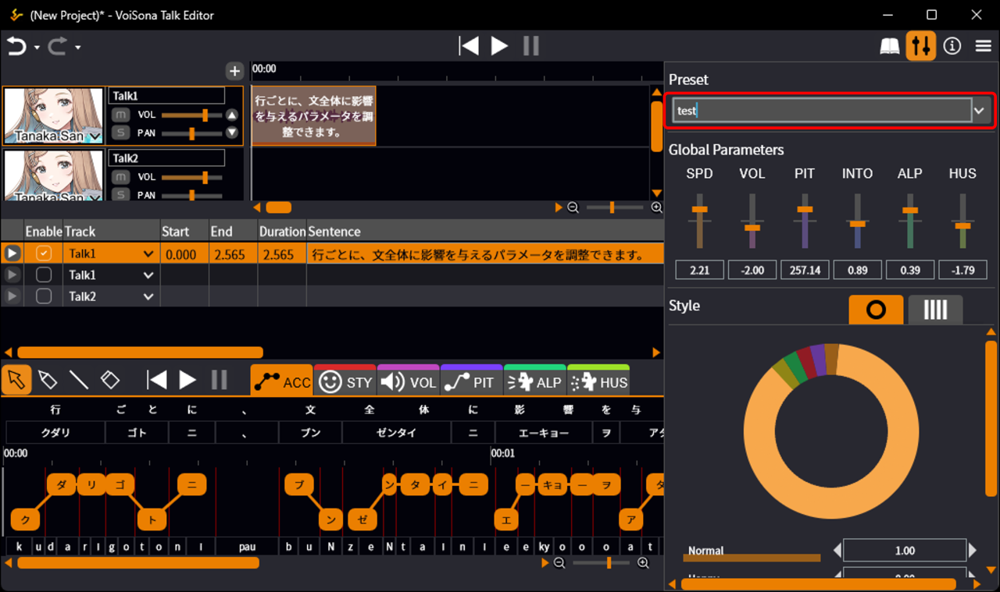
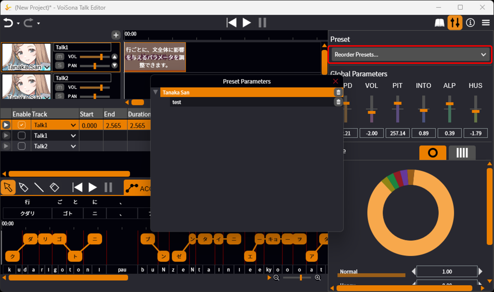
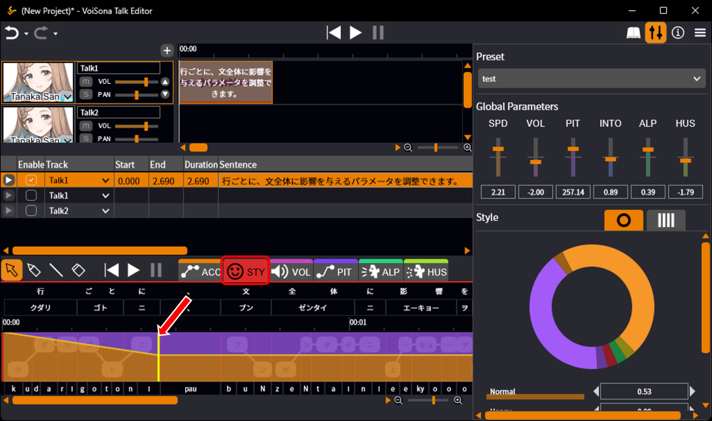
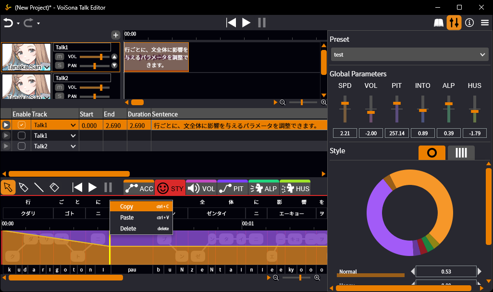
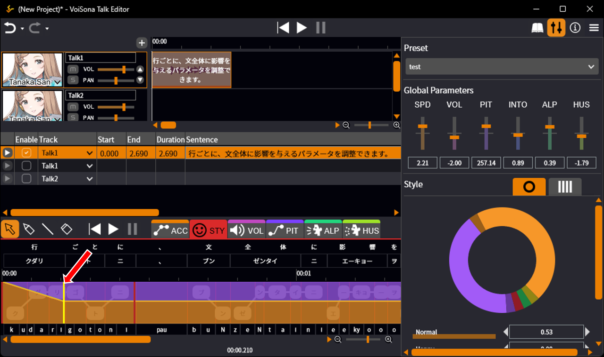
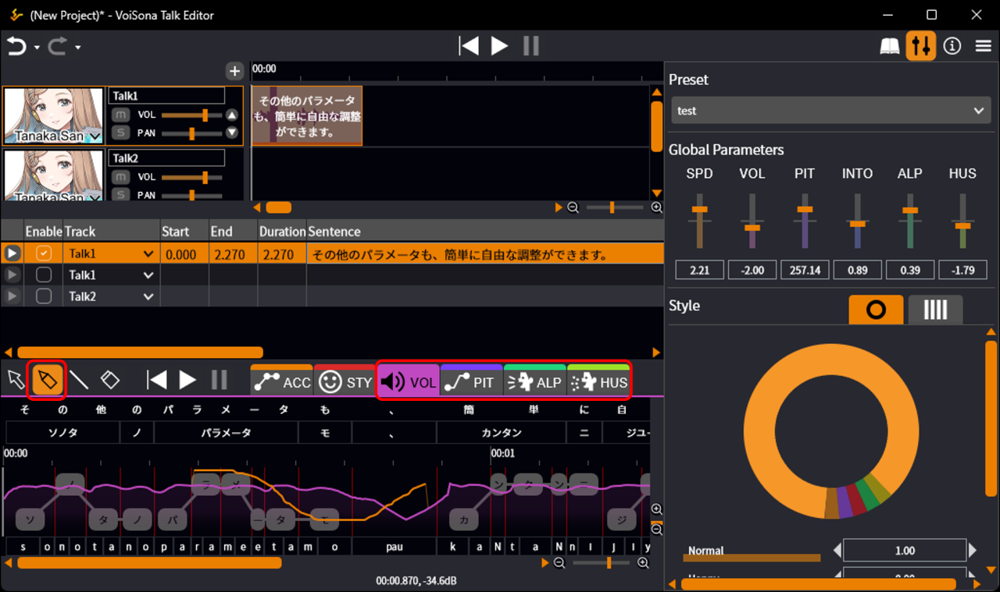
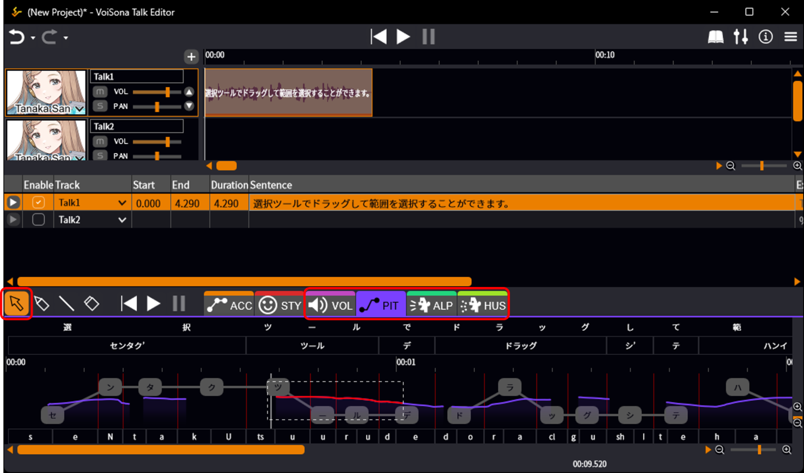
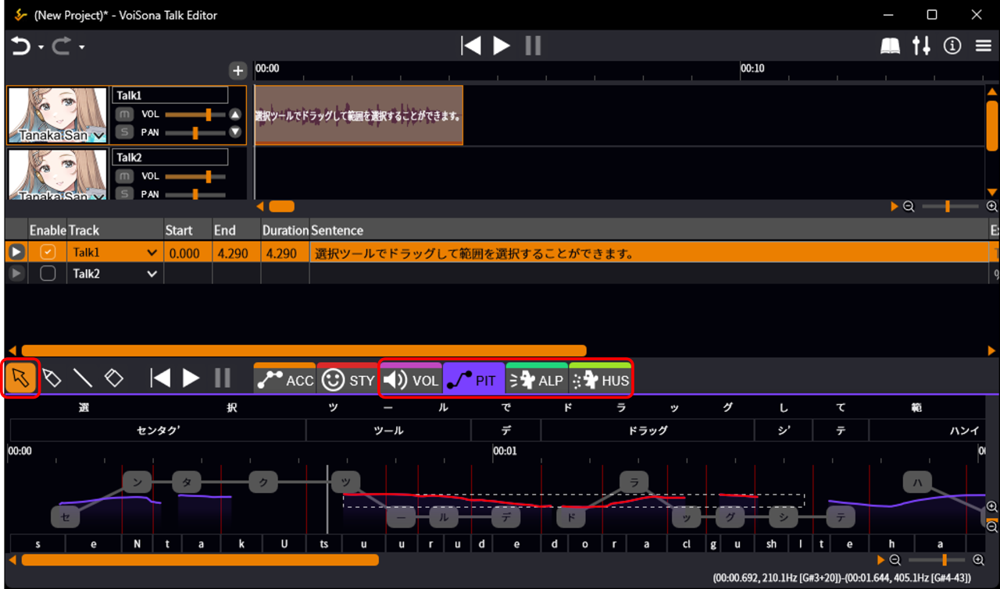

原文：[パラメータを調整する](https://manual.voisona.com/en/talk/pc/2b6e9bc7efb1801182c9f71cac120191)

---

# 调整参数

在 VoiSona Talk 中，您可以精细调整语速、音量、音高和风格等参数。

可以调整影响整个短语的参数（全局参数），也可以通过切换标签页在时间轴上精细调整参数。

## 调整全局参数

可以对单句台词调整影响整个台词的参数，例如语速、音量和音高。

1. 点击「参数」按钮，显示面板。
2. 在全局参数区域，直接输入数值或使用滑块进行调整。
   

!!! info "可调整的参数"
      - SPD：语速。
      - VOL：音量。
      - PIT：音高。
      - INTO：语调。数值越低语调越平坦，数值越高越富有表现力。
      - ALP：音色/声质。数值越小越像小孩，数值越大越像大人。
      - HUS：沙哑度。数值越大声音越沙哑。

## 调整台词风格

可以按任意比例混合「Happy」和「Angry」之类的多种风格。

1. 点击「参数」按钮，显示面板。
2. 在风格区域，点击右上角的标签页，选择饼图或条形图视图。
3. 直接输入数值或操作图表来调整各风格的比例。
   

!!! info "关于风格的比例"
      组合风格时，最终输出基于各指定值相对于总和的比例。

      例如，「Happy 100」和「Angry 100」组合的结果是 50/50 的混合。这意味着「Happy 100 + Angry 100」和「Happy 50 + Angry 50」产生相同的结果。

!!! info
      可用的风格及数量因声库而异。

## 保存参数设置（预设）

可以将全局参数和风格的调整保存为预设。

1. 点击「参数」按钮，显示面板。
2. 调整全局参数和风格设置。
3. 在预设区域点击显示「在此输入新名称」的位置。
4. 输入文字并确认。  
   这样就可以保存预设，之后可以点击「v」图标从列表中选择。
   

!!! info
      选择「默认」会将参数设置恢复为初始状态。

!!! info
      选择「排序预设」可以删除或重新排序预设。  
      点击声库名称右侧的垃圾桶图标将删除该声库中注册的所有预设。
      

## 调整高级参数

通过切换标签页，可以在时间轴上精细调整参数。

### 在指定位置调整风格

可以在台词中指定精确位置应用风格，并为每个位置单独调整风格。

1. 点击「STY」标签页显示调整画面。
2. 点击想要应用风格的位置。
3. 根据需要调整风格。  
   调整后的风格将应用于指定位置。
   

!!! info
      关于如何调整风格的详细信息，请参阅[调整台词风格](#_3)。

#### 复制风格

右键点击要复制的风格位置，选择「复制」。

然后点击要应用风格的位置，选择「粘贴」，复制的风格就会应用到该位置。

### 调整其他参数

其他参数也可以轻松自由地调整。

1. 点击「VOL」「PIT」「ALP」「HUS」之一的标签页显示调整画面。
2. 选择「画笔工具」或「直线工具」。

    !!! info
        使用「画笔工具」进行自由绘制，使用「直线工具」进行直线编辑。

3. 绘制线条进行调整。
   

!!! info
      绘制的线条以橙色显示，可以区分手动编辑区域和原始参数曲线。

!!! info "可调整的参数"
      - VOL：音量。单位是 dB（分贝）。
      - PIT：音高。单位是 Hz（赫兹）。
      - ALP：音色/声质。数值越小越像小孩，数值越大越像大人。
      - HUS：沙哑度。数值越大声音越沙哑。

#### 选择并操作范围

在 VOL、PIT、ALP 和 HUS 调整画面中，可以使用选择工具拖动来选择范围。

按住 <kbd>Alt</kbd> 键拖动会自动调整垂直范围以包含当前参数。

选中后，可以移动、放大、缩小或删除所选范围内的参数。

按住 <kbd>Shift</kbd> 键移动时，移动方向将限制为水平或垂直方向。
