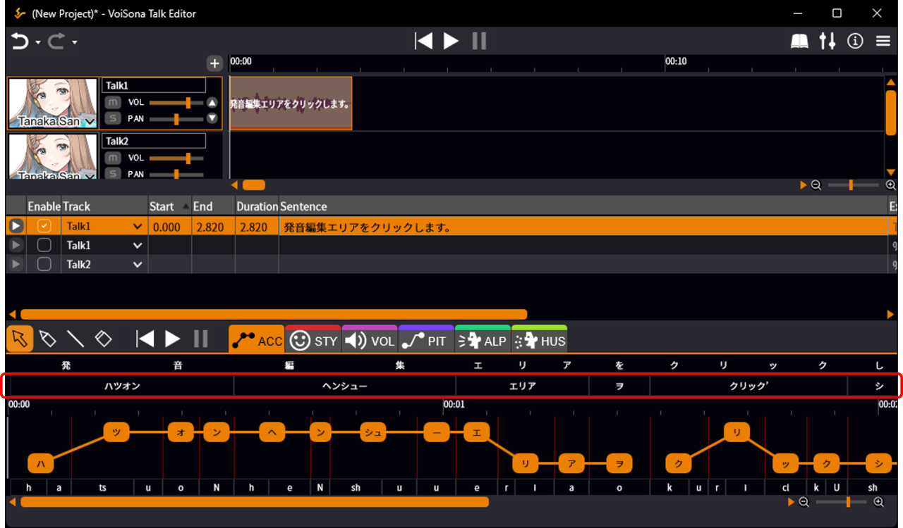
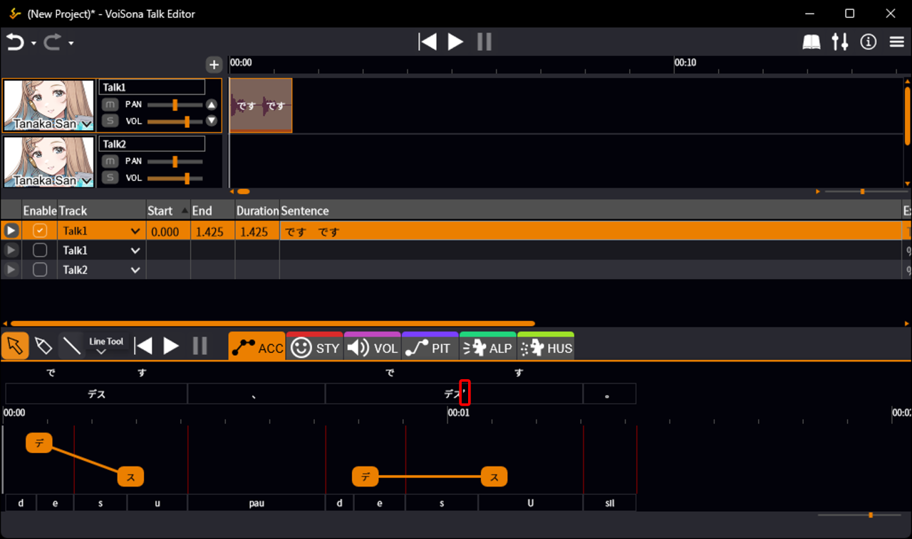
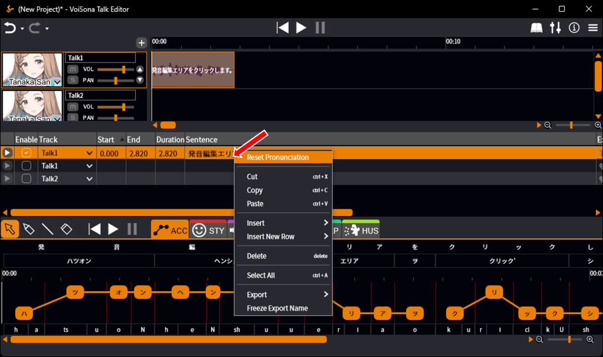
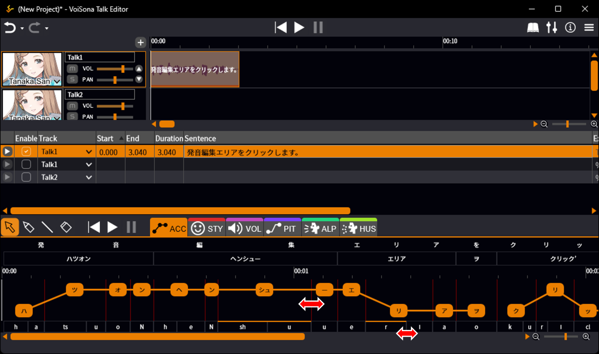
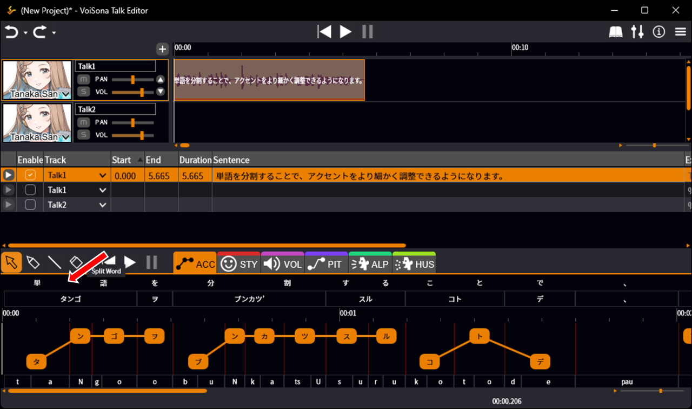
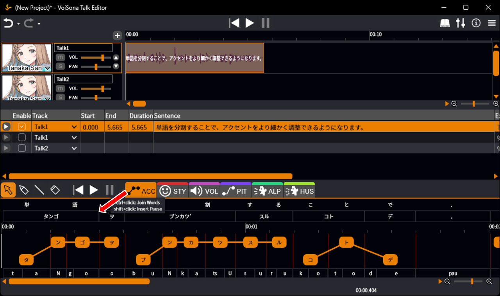
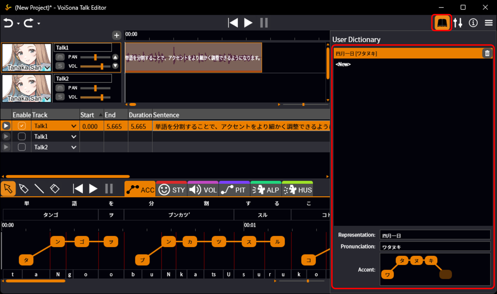
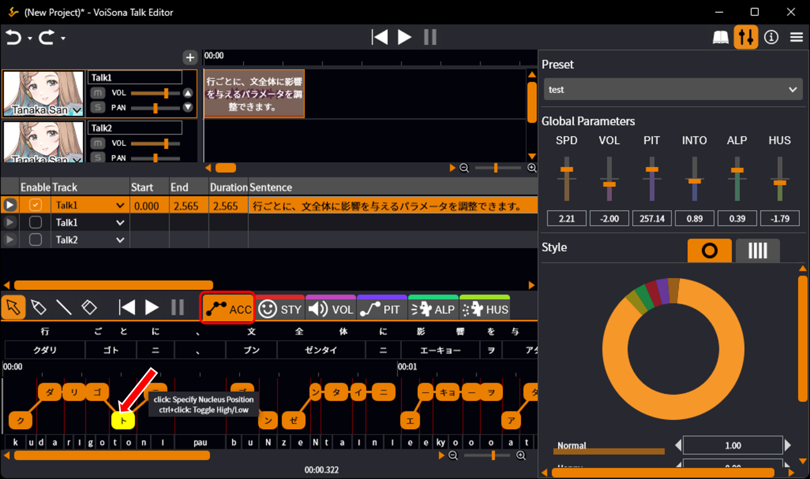
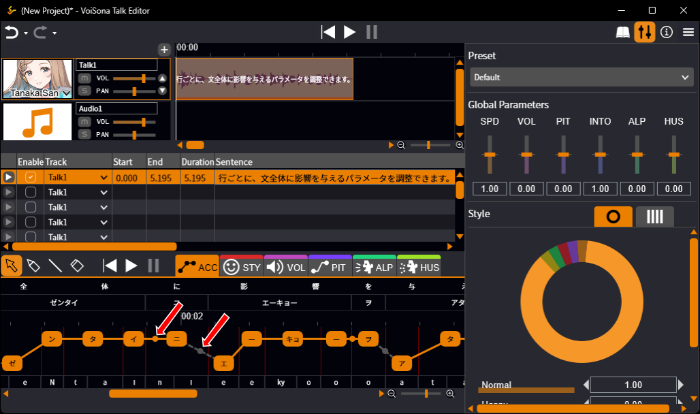
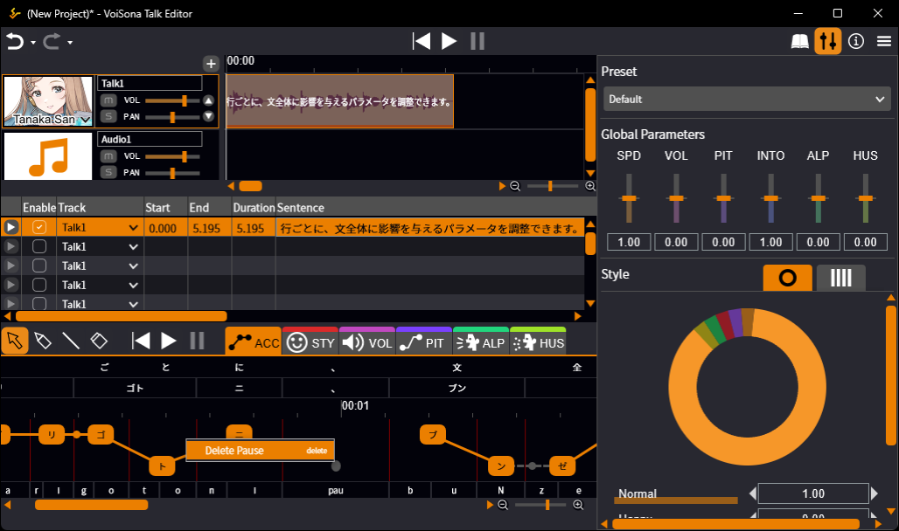

原文：<https://manual.voisona.com/en/talk/pc/2b6e9bc7efb180989669c4e9aca67fed>

---

# 编辑台词

在下方的调整画面中，可以详细编辑发音以实现更自然的语音。

## 更改发音

本节介绍编辑发音的各种操作。

### 修改文本的读法

可以直接修改所输入文本的读法。

1. 点击发音编辑区域。
2. 发音的编辑方法因语言而异，如下所示：
   - **日语**：使用片假名或平假名编辑读法。
   - **英语**：使用半角字母数字字符编辑音素。
     

!!! info
      输入与编辑带来的发音变化
      在 VoiSona Talk 中，当台词的一部分被修改时，未更改部分的发音和重音会尽可能保持一致。因此，相同的台词可能会因输入或编辑方式的不同而产生不同的发音。
      示例：
      - 在台词中输入「昨日は雨」  
        → 台词为「昨日は雨」，发音为「キノーワアメ」
      - ① 在台词中输入「昨日は晴」，将「キノー」的发音改为「サクジツ」  
        ② 将「晴」改为「雨」  
        → 台词为「昨日は雨」，发音为「サクジツワアメ」  
        （即使在步骤②中修改了部分台词，步骤①中当时未修改的部分的发音也不会被重置。）

---

### 省略元音（日语声库）

在读音末尾添加全角撇号（'），可以使元音清化。

示例：
- 将读音设为「デス」  
  → 音素变为「d, e, s, u」
- 将读音设为「デス'」  
  → 音素变为「d, e, s, U」（/u/ 变为清化音素 /U/）

---

### 英语音素（英语声库）

英语音素及其对应的 IPA 符号，请参阅官方手册中的对照表。

英文单词的重音（强调部分）可以通过在元音后添加数字来表示。不过，即使指定了重音，合成语音的差异也可能不大。

- 无重音：`0`
- 主重音（发音最强的部分）：`1`
- 次重音（发音较强的部分）：`2`

!!! info
      在使用日语声库输入英语台词时，将逐字母朗读，如「エー・ビー・シー」。

---

## 重置发音

重置发音可将文本的发音恢复到编辑前的状态。

1. 右键点击文本，选择「重置发音」。  
   所选行的发音将恢复到编辑前的状态。
   

!!! info
      如果台词中包含在[用户词典](#_10)中注册的单词，将应用其发音。

---

## 调整发音长度

在下方的调整画面中，可以精细调整发音长度。

1. 执行以下操作之一：
   - **按音素调整**：拖动调整画面底部的灰色竖线。
   - **按莫拉调整**：在 [ACC](adjust-params.md) 调整画面中拖动红色竖线。
     

!!! info
      双击竖线可将发音长度重置为原始状态。

---

## 编辑单词

通过调整单词划分，可以产生更自然的合成语音。还可以将单词注册到用户词典中以应用特殊发音。

### 分割单词

通过分割单词，可以更精细地调整重音。

1. 将鼠标光标移动到单词内字符之间的位置。  
   鼠标光标变为剪刀形状。
2. 在该位置点击。  
   单词被分割。
   

!!! info
      关于调整重音的更多信息，请参阅[编辑重音](#_11)。

---

### 合并单词

通过合并单词，合并后的单词可以被视为一个单词。

1. 将鼠标光标移动到发音编辑区域中单词的边界处，按住 Ctrl 键。  
   鼠标光标变为绑定形状。
2. 在该位置点击。  
   单词被合并。
   

!!! info
      在单词边界处 Shift + 点击可以插入停顿（、）。

---

### 注册单词（用户词典）

可以将通常无法正确发音的难读人名或地名注册到用户词典中，以实现正确的发音。

1. 点击「用户词典」按钮打开面板。
2. 选中 `<新建>`，配置以下项目：
   - **表示**：使用全角字符（汉字、字母、片假名或平假名的组合）输入要注册的单词。
   - **发音**：使用全角片假名输入单词的发音。
   - **重音**：点击设置重音位置。输入发音后按 Enter 键可启用重音指定。
     

!!! info
      用户词典中的更改不会自动应用到已输入的台词中。  
      要应用词典设置，请[重置发音](#_5)。

---

## 编辑重音

可以调整台词中的重音位置。还可以分割重音短语以进行更精细的调整。

!!! info
      重音短语（Accent Phrase）  
      重音短语是台词中重音的单位。一个台词被分为多个重音短语，每个可以独立调整。  
      示例：「今日はいい天気ですね」→「今日は｜いい｜天気｜ですね」

!!! info
      莫拉（Mora）  
      莫拉是表示发音节奏的单位，也称为「拍」。  
      在日语中，每个假名字符通常对应一个莫拉。但小「っ」、拨音「ん」和长音符号「ー」也分别算作一个莫拉。此外，「きゃ」等拗音（与小「ゃ」「ゅ」「ょ」的组合）被视为一个莫拉。  
      示例：「今日は晴れ」→「キョ・ー・ワ・ハ・レ」

### 调整重音

可以精细调整台词的重音位置。

1. 点击「ACC」标签页打开调整画面。
2. 可以对显示的莫拉执行以下操作：
   - **指定重音核位置**：点击莫拉
   - **切换音高（高/低）**：Ctrl + 点击莫拉
     

---

### 分割与合并重音短语

重音短语也可以被分割或合并。

1. 将鼠标光标移动到单词边界处显示的圆圈上并点击。
   - **橙色圆圈**：重音短语处于合并状态。光标变为剪刀图标，点击将分割重音短语。
   - **灰色圆圈**：重音短语处于分割状态。光标变为绑定图标，点击将合并重音短语。
     

!!! info
      重音短语只能在单词边界处进行分割。  
      关于创建单词边界的说明，请参阅[分割单词](#_8)。

---

### 添加或删除停顿

可以在单词边界处添加停顿，或删除已有的停顿。

1. 右键点击单词边界处的圆圈或停顿（、）上的圆圈。
2. 从显示的菜单中选择操作：
   - **「插入停顿」**：在单词边界处添加停顿（、）。
   - **「删除停顿」**：删除停顿（、）。
     
