原文：<https://manual.voisona.com/en/talk/pc/2b6e9bc7efb180acae67d361b086729a>

---

# 输入台词

在 VoiSona Talk 中，您可以轻松添加台词并自由排列。

## 输入台词

可以按照以下步骤输入文本：

1. 点击「台词」列中的单元格。
2. 在单元格中输入文本。
3. 按 Enter 键确认文本。
   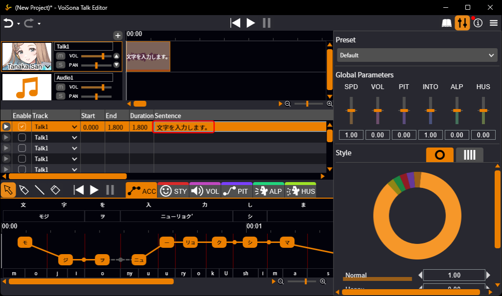

!!! info
      要选择下一行，请按 Ctrl+Enter。

!!! info
      支持的字符与最大输入长度
      - **日语声库**：可输入由全角平假名、片假名和汉字组成的日语文本。
      - **英语声库**：可输入由半角字母和数字组成的英语文本。
      - 不能输入半角字符「<」。
      - 每句台词最多可输入 500 个字符。

!!! info
      自然语音合成提示
      合成语音受该行中整句台词的影响。  
      为获得更自然的朗读效果，请每行输入一句话，并使用「、」（日文逗号）适当分隔较长的句子。  
      在句末添加「?」或「!」将为朗读方式增添变化。

---

## 移动台词

可以更改已输入台词的开头时间，或将其移动到其他轨道。

### 在时间轴上移动台词

输入台词后，台词元素将出现在轨道时间轴上。通过移动此台词元素，可以自由调整台词的位置。

1. 执行以下操作之一：
   - **更改开头或结尾时间**：左右拖动台词元素。
   - **更改轨道**：上下拖动台词元素。
     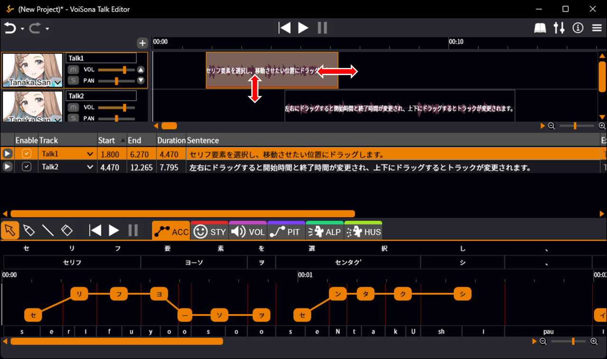

!!! info
      按住 Ctrl 键点击可以选择多个台词。

---

#### 通过指定时间移动台词

也可以在每行的「开头」或「结尾」列中点击项目，输入开头时间或结尾时间的数值来移动台词。更改也会反映到轨道的时间轴上。

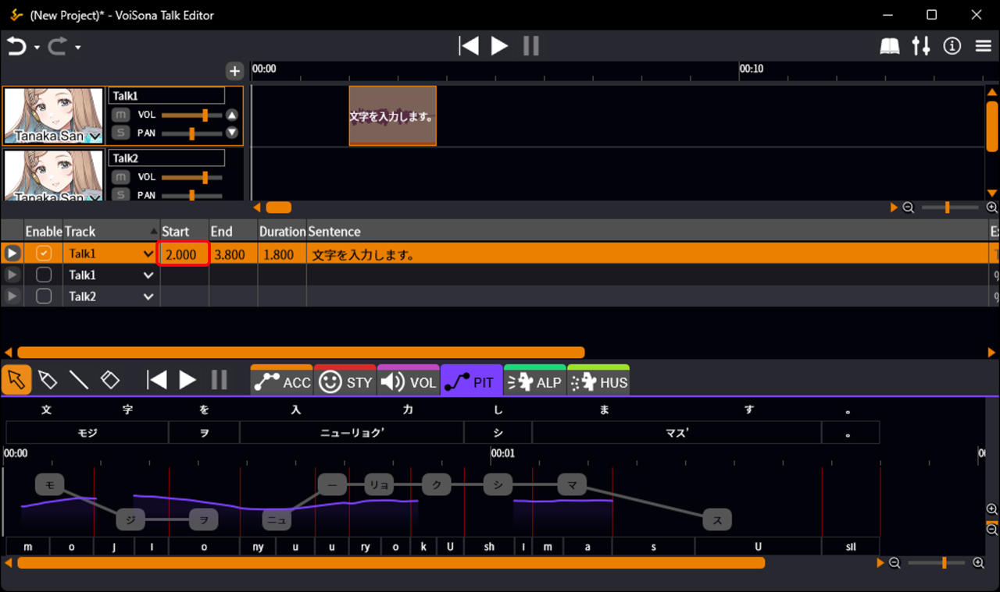

!!! info
      点击「开头」列标题可以按开头时间升序排列列表。
      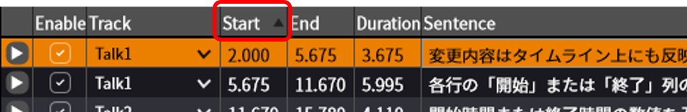

---

### 更改台词分配的轨道

可以按照以下步骤更改台词分配的轨道。

1. 点击该行「轨道」列中的项目。
2. 从下拉菜单中选择所需的轨道。
   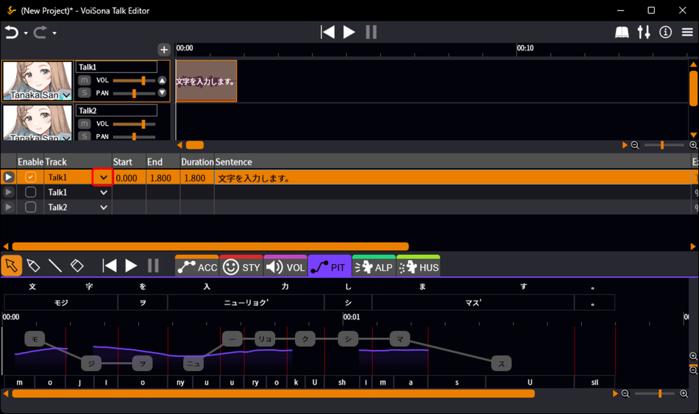

!!! info
      点击「轨道」列标题可以按与轨道列表相同的顺序排列列表。
      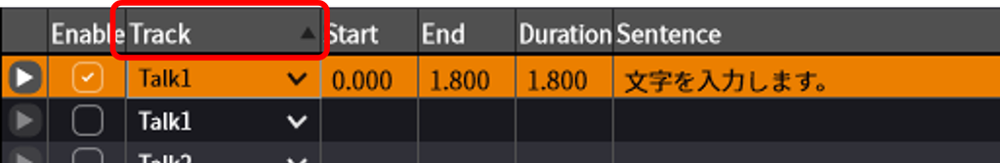

---

## 编辑台词列表

通过删除、插入等操作编辑台词列表。

### 删除行

可以按照以下步骤删除行。

1. 点击要删除的行上的垃圾桶图标。  
   该行被删除，下面的行自动上移。
   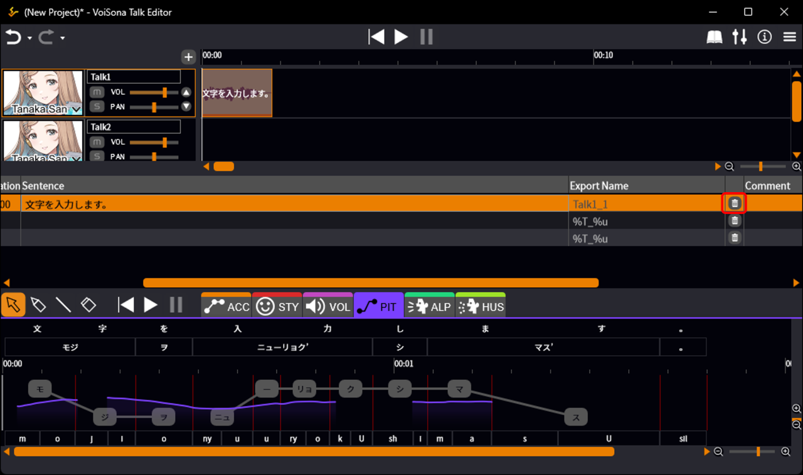

---

### 插入新行

可以按照以下步骤插入行。

1. 右键点击某一行，选择「插入新行」>「在上方插入」或「在下方插入」。  
   将在所选行的上方或下方插入一个空白行。
   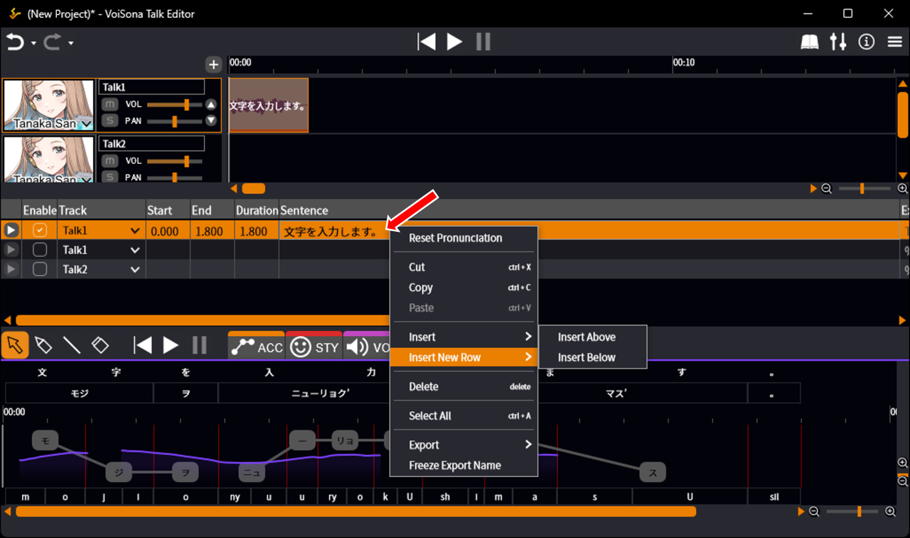

!!! info
      在轨道的最后一行按 Ctrl+Enter 输入文本时，其下方将插入一个新行。

---

#### 从时间轴添加

右键点击轨道时间轴，选择「添加新台词」，将在台词列表的相应位置插入一个空白行。

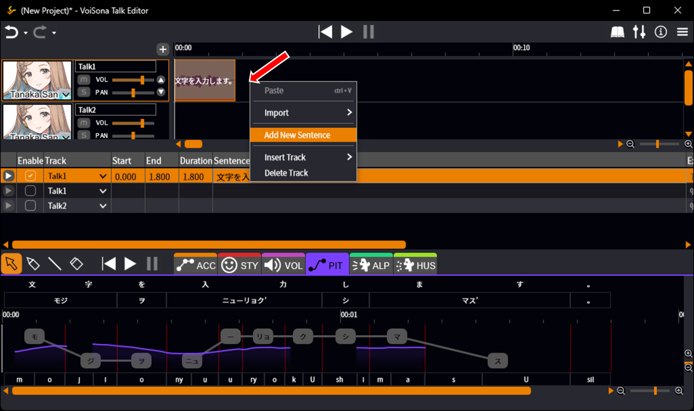

---

### 插入复制的行或文本

可以按照以下步骤插入复制的行或文本。

1. 从 VoiSona Talk 复制行或文本，或从其他应用程序复制文本。
2. 右键点击台词列表中的某一行，然后选择「插入」>「在上方插入」或「在下方插入」。  
   包含复制文本的行将被插入。
   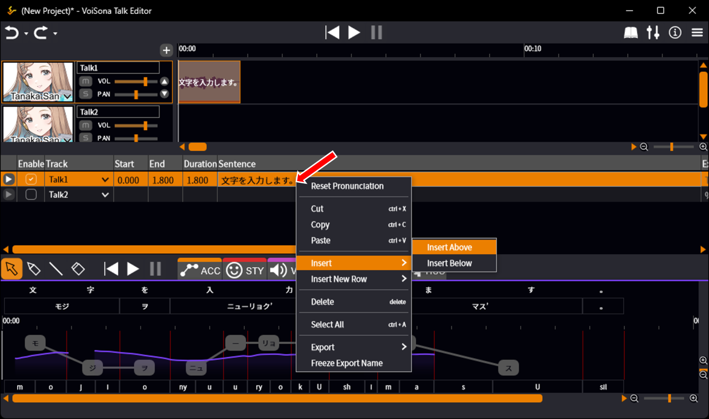
   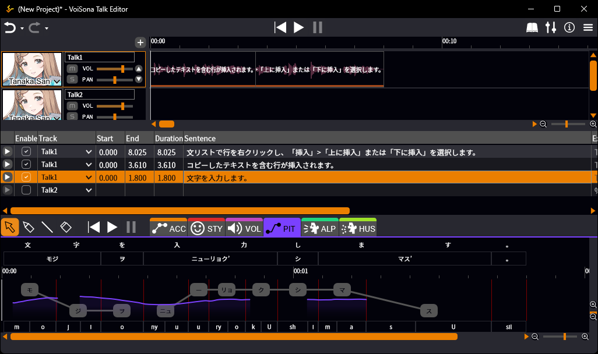

!!! info
      「插入」与「粘贴」的区别
      - **插入**：所有复制的内容作为新行插入。
      - **粘贴**：复制的内容覆盖现有文本。如果复制了多行，下面的行也会被覆盖。即使现有行不够，也不会添加新行。

---

## 编辑轨道

VoiSona Talk 允许创建多个轨道。可以为每个轨道分配不同的声库。

### 添加轨道

可以按照以下步骤添加轨道。

1. 选择「+」>「添加轨道」或「添加音频轨道」。  
   新轨道将添加到轨道列表底部，台词列表中将出现新行。
   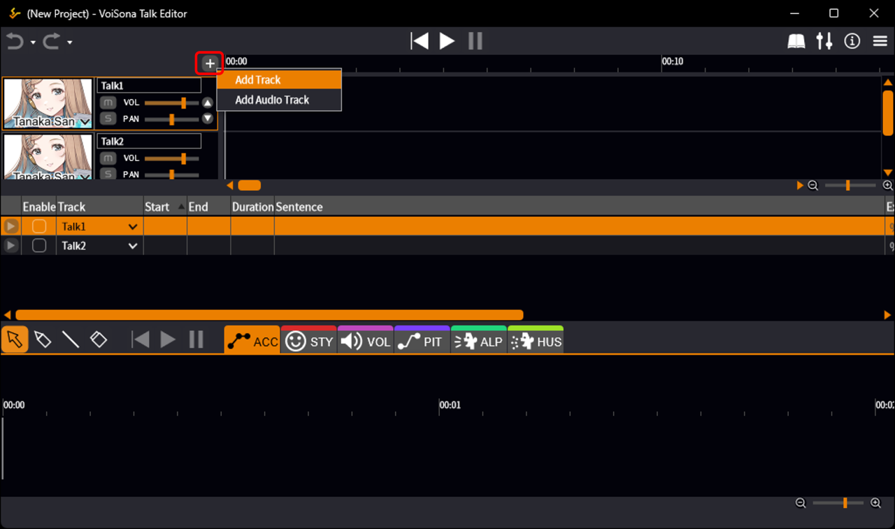

!!! info
      选择轨道并点击「▲」或「▼」按钮可以更改轨道顺序。
      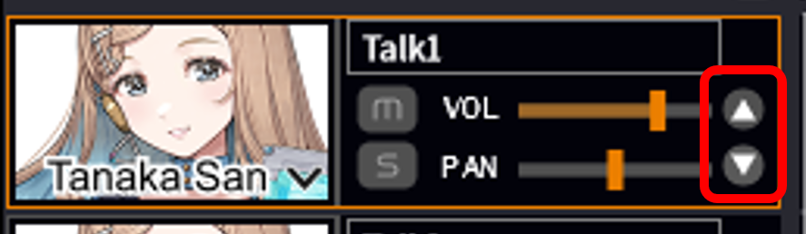

---

#### 在所选轨道上方插入新轨道

右键点击轨道时间轴，然后选择「插入轨道」>「轨道」或「音频轨道」，将在该轨道上方插入一个新轨道。

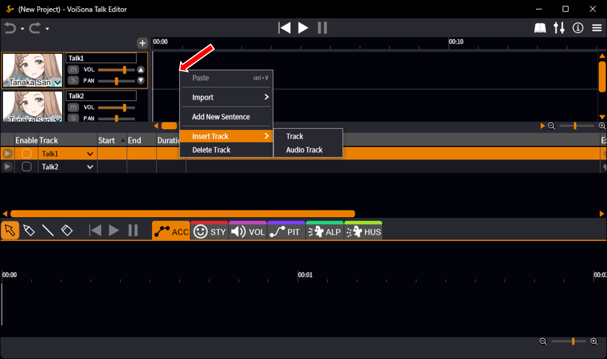

---

### 更改轨道名称

可以按照以下步骤编辑轨道名称。

1. 在轨道列表中，点击要更改的轨道名称。
2. 编辑文本并确认。  
   轨道名称将在轨道列表和台词列表中同时更新。
   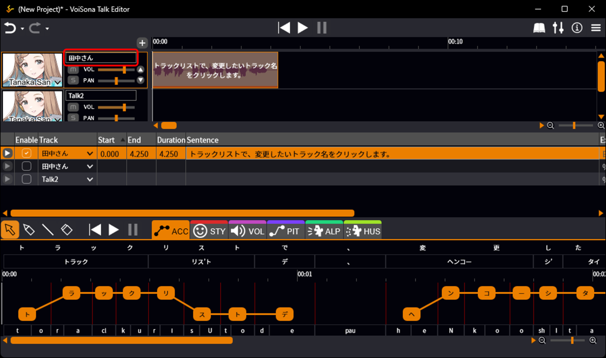
