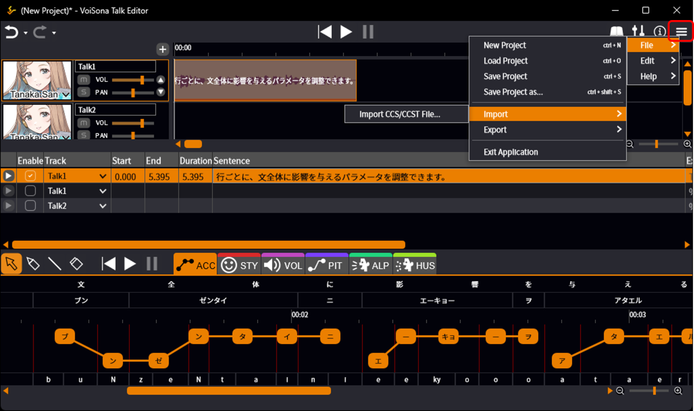
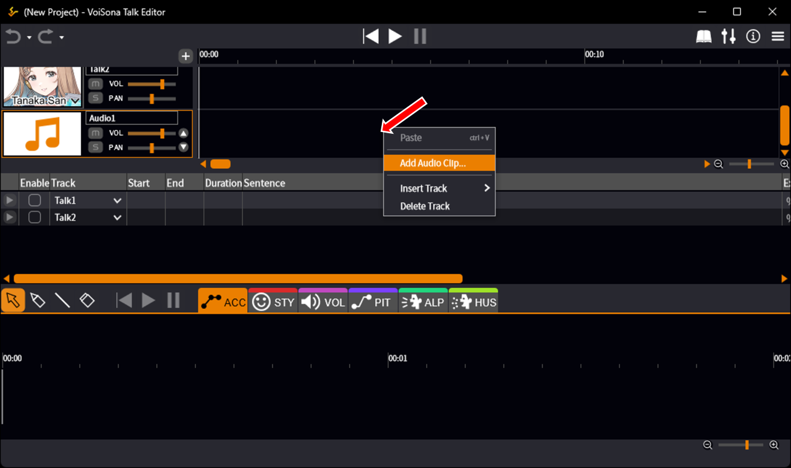
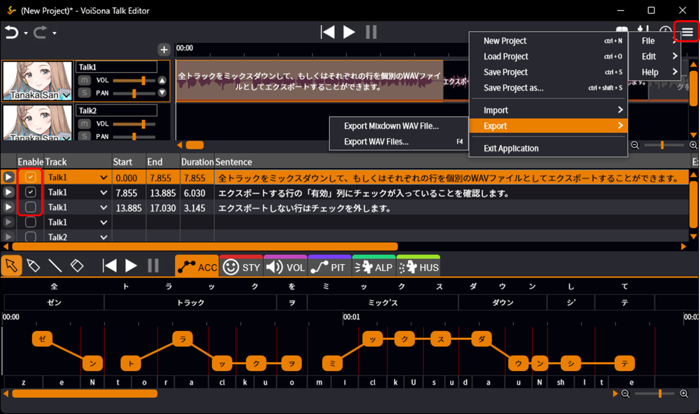
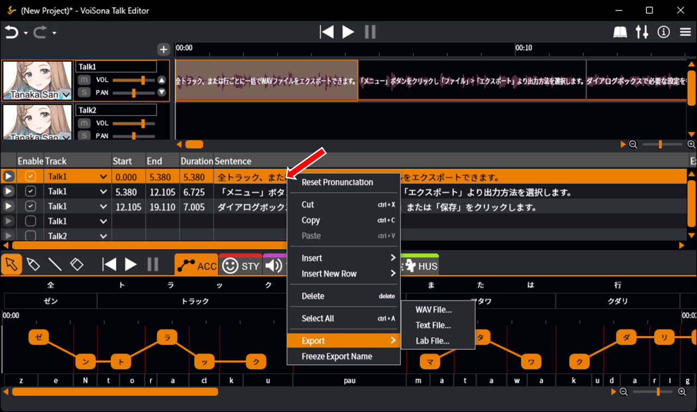
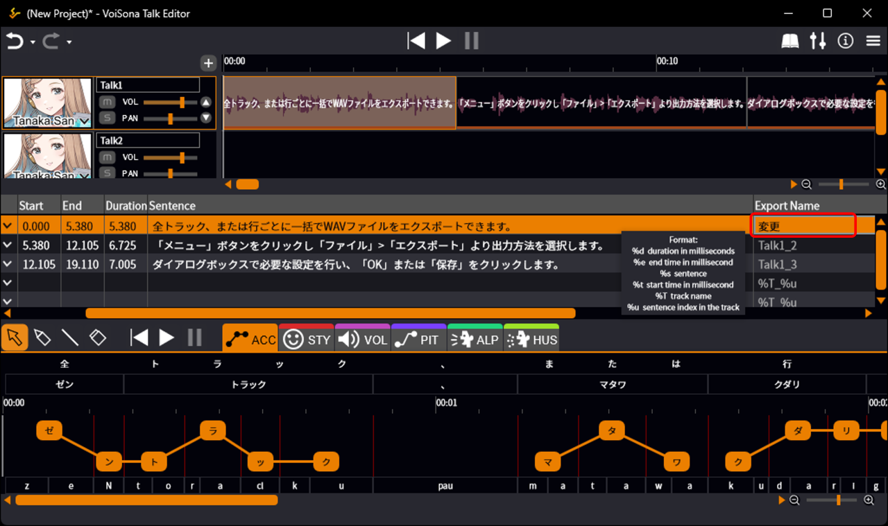
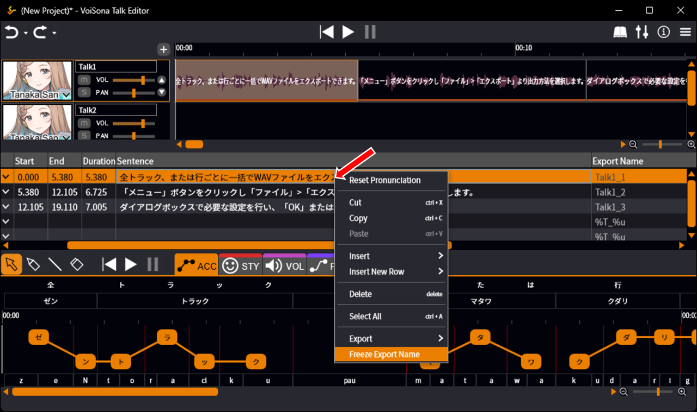

原文：[ファイルをインポート・エクスポートする](https://manual.voisona.com/en/talk/pc/2b6e9bc7efb180199896dbf2e5368a6a)

---

# 导入与导出文件

可以读取 VoiSona Talk 或其他应用程序创建的文件，也可以导出编辑中的数据。

## 导入文件

可以导入其他项目或其他应用程序创建的文件。

!!! warning
      请在导入前更改声库。

1. 从菜单中，选择「文件」>「导入」>「导入 CCS/CCST 文件」。
   
2. 选择文件并点击「打开」。  
   文件中包含的朗读轨道台词将添加到当前选中的轨道中。

!!! info "可导入的文件格式"
      - CCS：CeVIO Creative Studio、CeVIO AI 以项目为单位保存的文件。
      - CCST：CeVIO Creative Studio、CeVIO AI 以轨道为单位保存的文件。

## 导入音频文件

可以将 WAV 等音频文件读取到音频轨道中使用。

1. 在音频轨道时间轴上右键点击，选择「添加音频片段」。
   
2. 选择文件并点击「打开」。  
   将会导入音频文件。

    !!! info
        将文件拖放到时间轴上也可以读取。

## 导出文件

可以导出文件以供其他项目或其他应用程序中使用。

### 批量导出台词

可以将所有轨道混合输出为一个文件，或将每一行分别导出为单独的 WAV 文件。

1. 确保要导出的行在「启用」列中已勾选。  
   取消不想导出的行的勾选。
2. 点击「菜单」按钮，选择「文件」>「导出」，然后选择所需的导出方式。
   
3. 在对话框中进行必要的设置后确认。  
   WAV 文件将保存到指定位置。

!!! info "文件格式与输出方式"
      - 混音 WAV 导出：将所有轨道合成为一个 WAV 格式文件输出。
      - WAV 文件导出：每行分别导出为单独的 WAV 文件，保存到文件夹中。

         可同时选择输出文本文件和 Lab 文件。

!!! info
      WAV 文件的采样率为 48 kHz。

### 导出所选台词

可以从文本列表中导出任意台词。

1. 在台词上右键点击，选择「导出」并选择所需的文件格式。
   
2. 在对话框中进行必要的设置后确认。  
   WAV 文件将会保存到指定位置。

!!! info "可导出的文件格式"
      - WAV 文件
      - 文本文件
      - Lab 文件

### 更改导出名称

按照以下步骤即可更改导出时使用的文件名。

!!! info
      如果不做任何更改，将应用[环境设置](settings.md)中「默认值」里设置的输出名称。

1. 在台词列表的「导出名称」列中选择一个项目。
   
2. 输入文本或符号后确认。

#### 替换导出名称中的字符串

!!! warning
      此功能为实验性功能，其行为可能会在未来版本中发生变更。

如果在环境设置或「导出名称」列中设置了以下任意符号，它们将自动替换为对应的字符串：

| 输入符号 | 替换后的字符串 | 补充说明 |
|------|----------|------|
| `%d` | 合成语音的时长（毫秒） | 支持数值前导零填充（需指定位数）（例：「%04d」，时长为 0.895 时→0895） |
| `%e` | 合成语音的结束时刻（毫秒） | 支持数值前导零填充（需指定位数）（例：「%04e」，结束时刻为 0.895 时→0895） |
| `%s` | 台词文本 | 原字符 `¥/:\*?"><\|` 将全部替换为 `_`（下划线）；可指定替换后的最大字符数（例：「%4s」，台词为「おはようございます」时→おはよう） |
| `%t` | 合成语音的开始时刻（毫秒） | 支持数值前导零填充（需指定位数）（例：「%05t」，开始时刻为 0.000 时→00000） |
| `%T` | 轨道名称 | 原字符 `¥/:\*?"><\|` 将全部替换为 `_`（下划线）；可指定替换后的最大字符数（例：「%4T」，轨道名为「トラック1」时→トラック） |
| `%u` | 轨道内的序号（从 1 起） | 支持数值前导零填充（需指定位数）（例：「%02u」，轨道第一条台词时→01） |

初始值为 `%T_%u`，可在[环境设置](settings.md)中更改。

「导出名称」列在输入台词前显示替换前的符号，输入台词后则显示替换后的字符串。

在台词上右键点击并选择「冻结导出名称」后，台词名称将被替换后的字符串覆盖，之后不再应用字符串替换。

