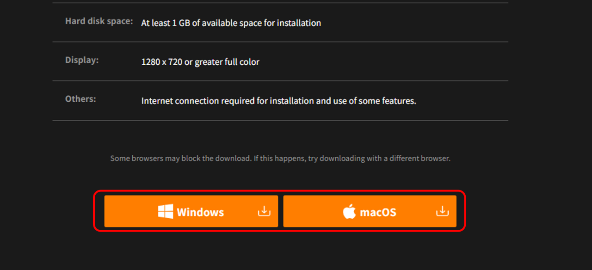
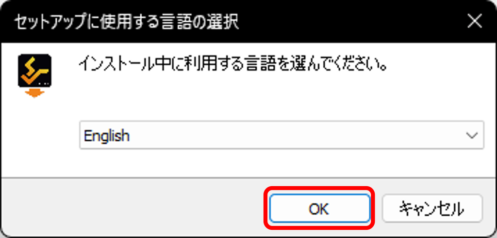
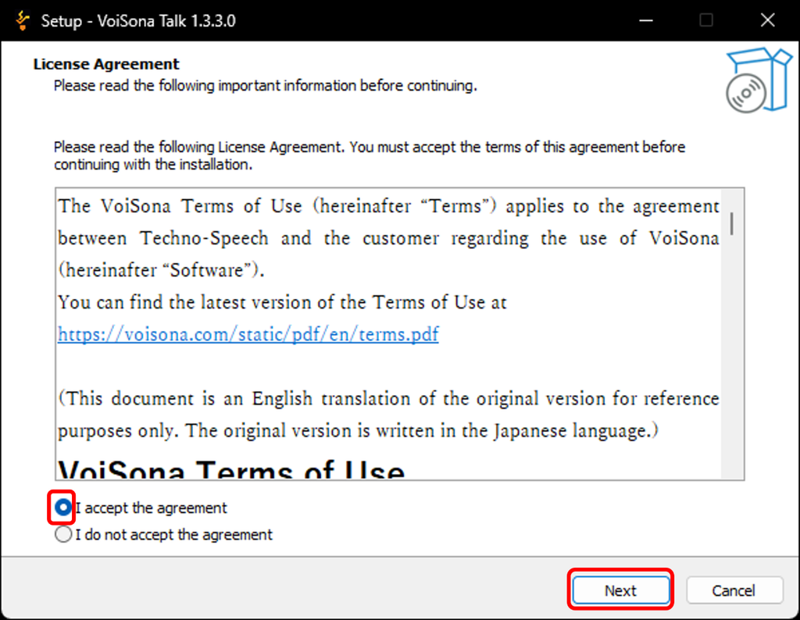
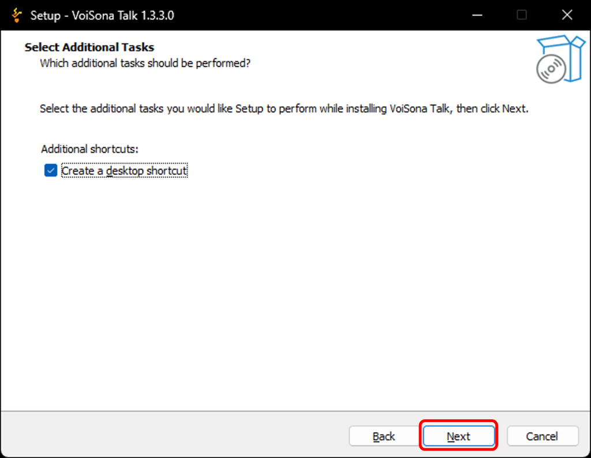
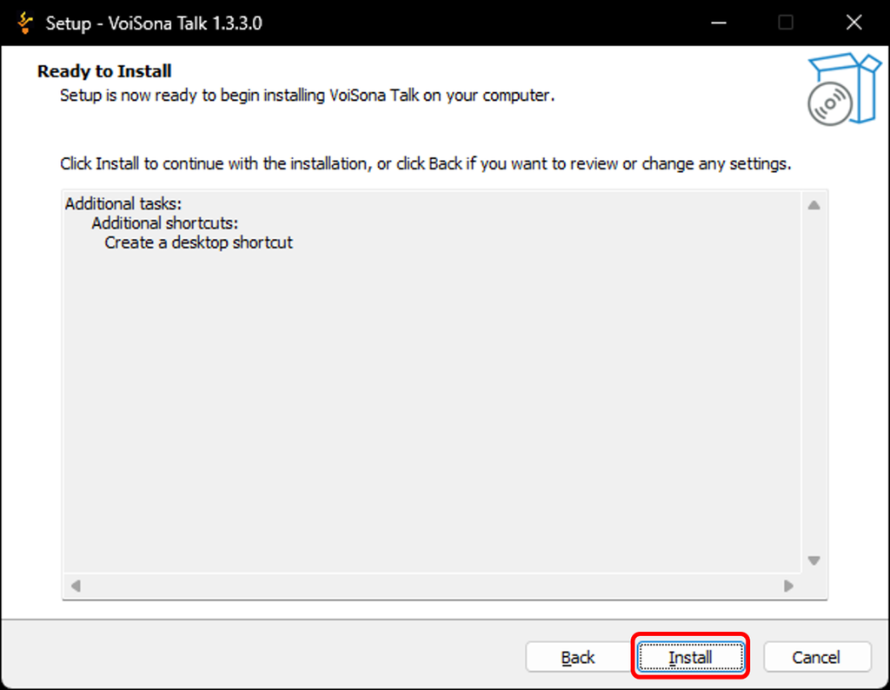
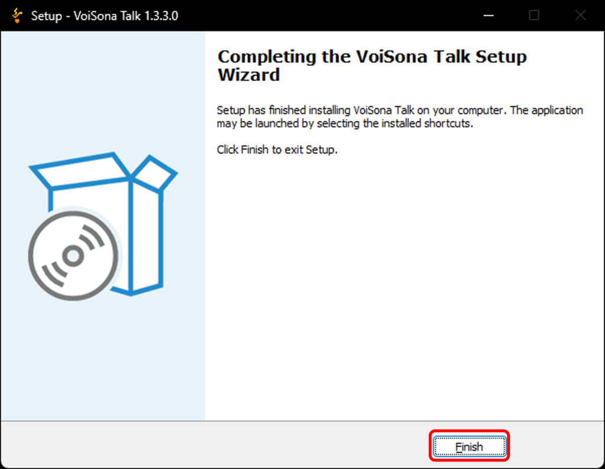

原文：<https://manual.voisona.com/en/talk/pc/2b6e9bc7efb1801794b5df6c00b8da70>

---

# 安装 VoiSona Talk

要使用 VoiSona Talk，请先安装应用程序。更新时也可按照相同的步骤进行。

!!! info
      请在电脑连接互联网的状态下进行操作。

1. 访问 [DOWNLOAD](https://voisona.com/talk/download/) 页面并登录。
2. 点击「Windows版」或「macOS版」按钮。  
   最新版本的安装程序将被下载。
   
3. 打开下载的安装程序。
4. 选择安装过程中使用的语言，点击「OK」。
   
5. 确认使用许可协议后，如同意则勾选「同意」并点击「下一步」。
   
6. 如需要在桌面创建图标请勾选，然后点击「下一步」。
   
7. 点击「安装」。  
   安装将开始。
   
8. 安装完成后，点击「完成」。
   

!!! info
      安装目标文件夹
      - **Windows**：`C:\Program Files\Techno-Speech`
      - **macOS**：`/Users/<用户名>/Library/Techno-Speech`
