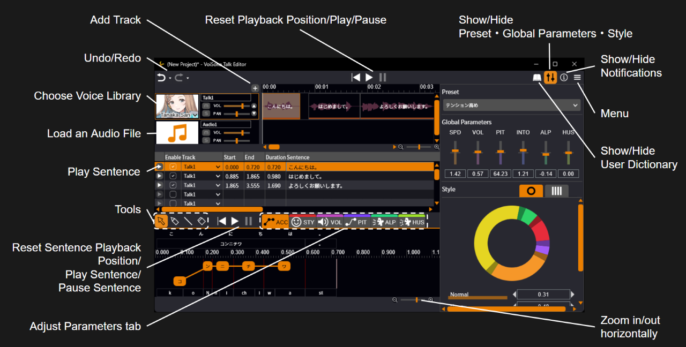

原文：[VoiSona Talkの使い方を知ろう。](https://manual.voisona.com/en/talk/pc)

---

# 学习 VoiSona Talk 的使用方法。

## 目录

1. [快速入门指南](quickstart.md)
2. [安装 VoiSona Talk](install.md)
3. [登录](login.md)
4. [选择声库](select-voice.md)
5. [输入台词](enter-sentence.md)
6. [编辑台词](edit-sentence.md)
7. [调整参数](adjust-params.md)
8. [导入与导出文件](import-export.md)
9. [更改环境设置](settings.md)
10. [REST API 教程](rest-api.md)
11. [常见问题](faq.md)
