原文：<https://manual.voisona.com/en/talk/pc/29ae9bc7efb180a8a1cae9f34bef1c72>

---

# 快速入门指南

本节介绍 VoiSona Talk 初次使用时的基本操作流程。

1. [安装 VoiSona Talk](install.md)。
2. 启动 VoiSona Talk。
3. 输入注册时使用的电子邮箱和密码，然后点击「OK」。
   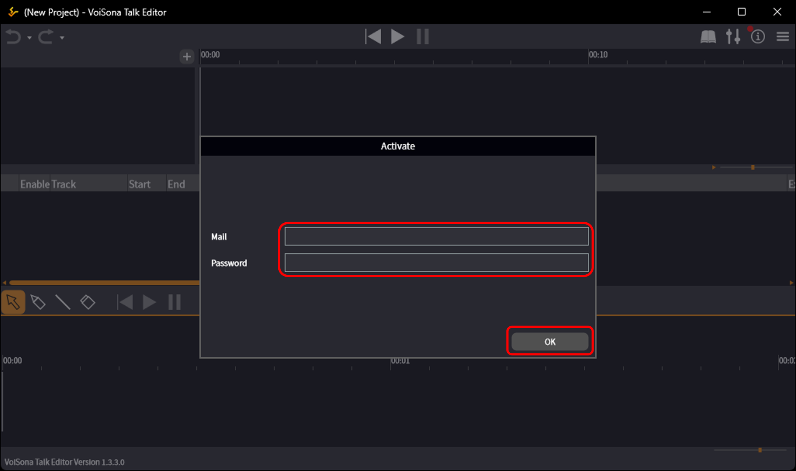
4. 点击显示「选择声库」的区域。  
   声库选择画面将显示出来。
   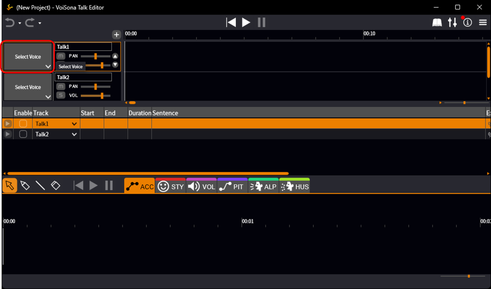
5. 点击想要使用的声库对应的「下载声库」按钮。  
   下载完成后，声库图像将显示出来。
   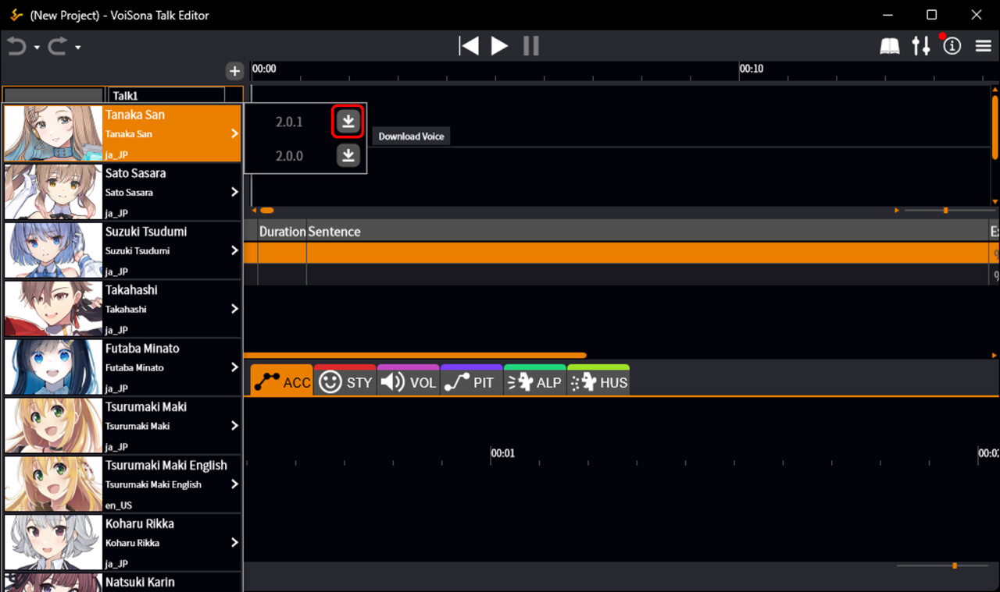
6. 在「台词」列的单元格中点击，输入台词后按 Enter 键。  
   台词将被添加。
   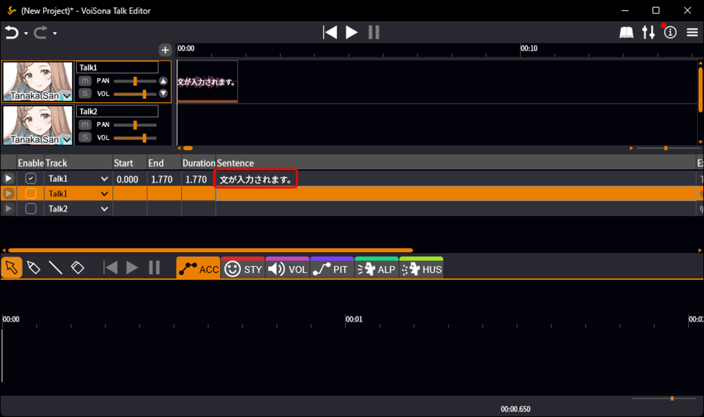
7. 点击轨道时间轴的上部。  
   播放位置光标将移动。
   
8. 点击「播放」按钮。  
   从播放位置光标处开始播放音频。
   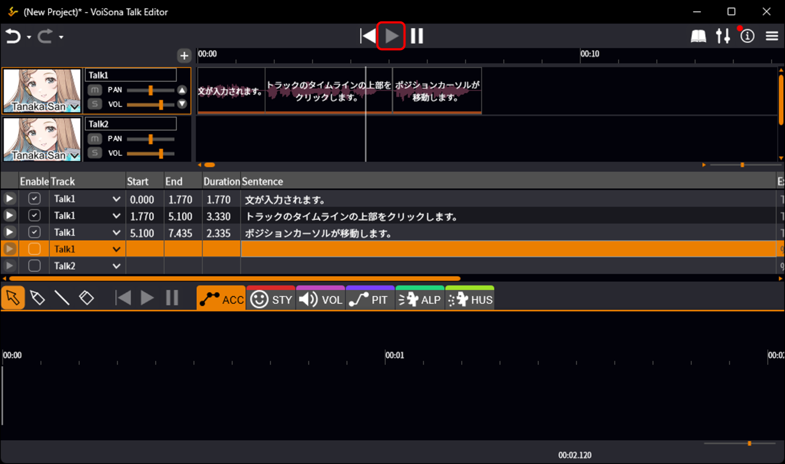
9.  点击「暂停」按钮。  
   音频将在播放位置光标处暂停。
   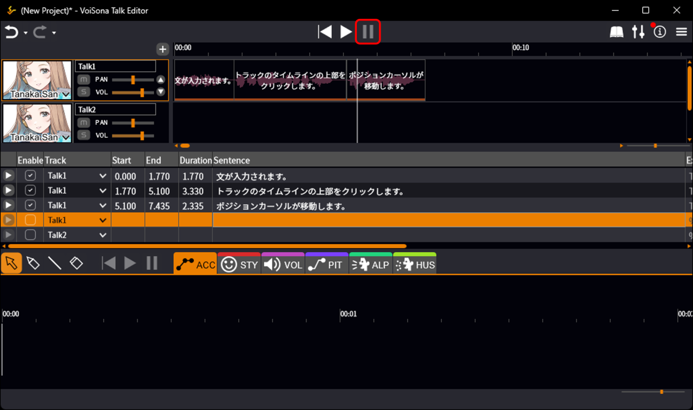
10. 点击「参数」按钮。  
   全局参数面板将显示出来。
11. 拖动「SPD」「VOL」「PIT」「INTO」「ALP」「HUS」的滑块。  
   这些参数将应用于整个台词。
   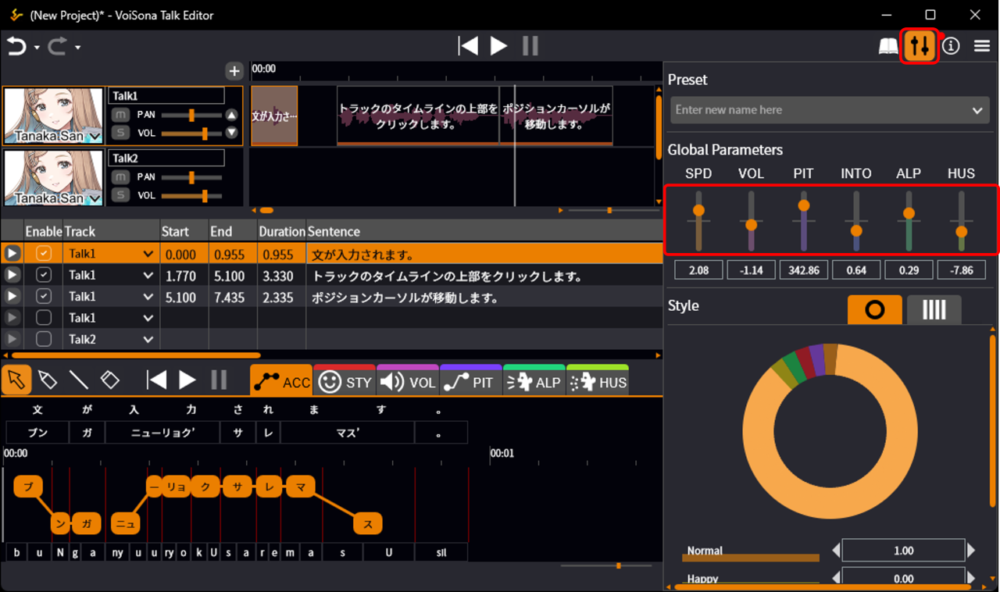
12. 在「ACC」调整画面中点击莫拉。  
   重音位置将被更改。
   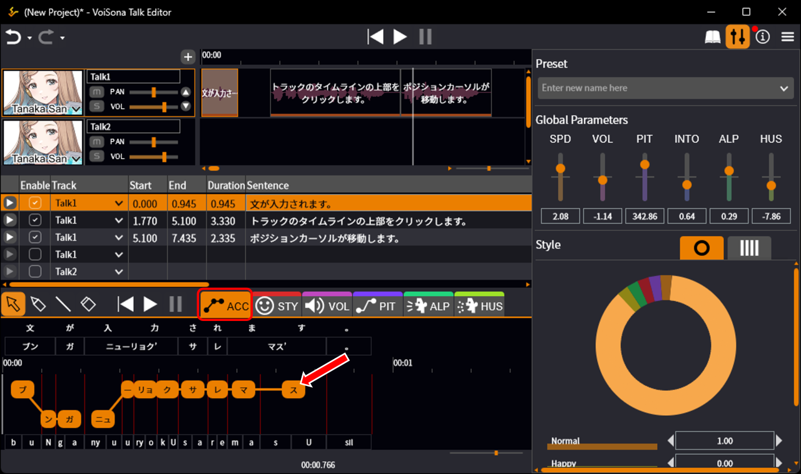
13. 在发音编辑区域编辑假名。  
   发音（读法）将被更改。
   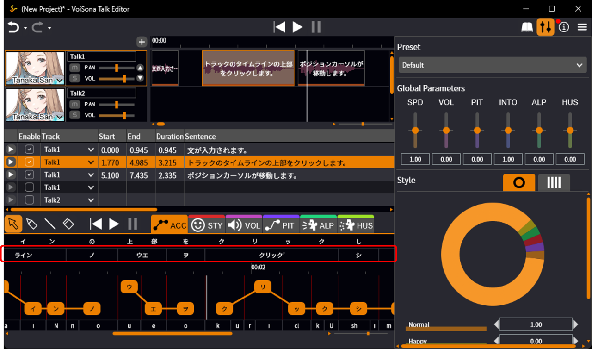
14. 点击「STY」标签页。
15. 在调整画面中点击指定位置，然后拖动风格图表进行移动。  
   台词的风格将被精细调整。
   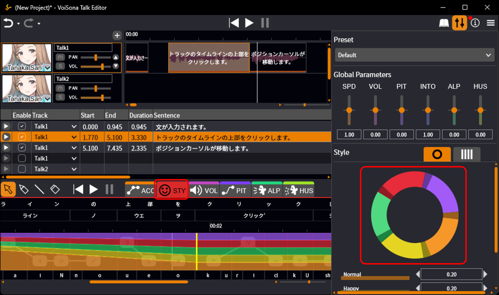
16. 点击「VOL」「PIT」「ALP」「HUS」之一的标签页。
17. 选择画笔工具，自由绘制线条。  
   各参数将被精细调整。
   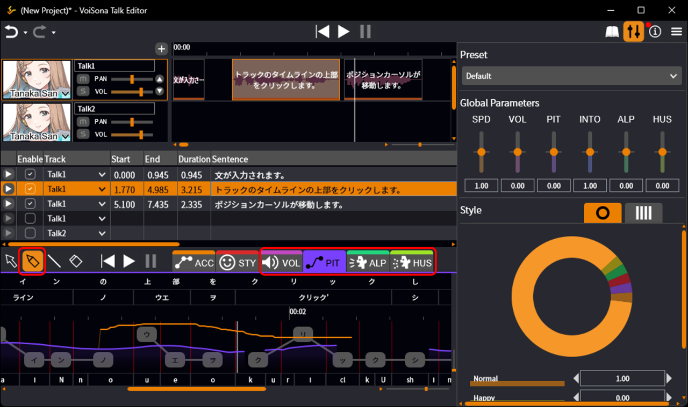
18. 点击「菜单」按钮，选择「文件」>「导出」>「导出混音 WAV 文件...」。
   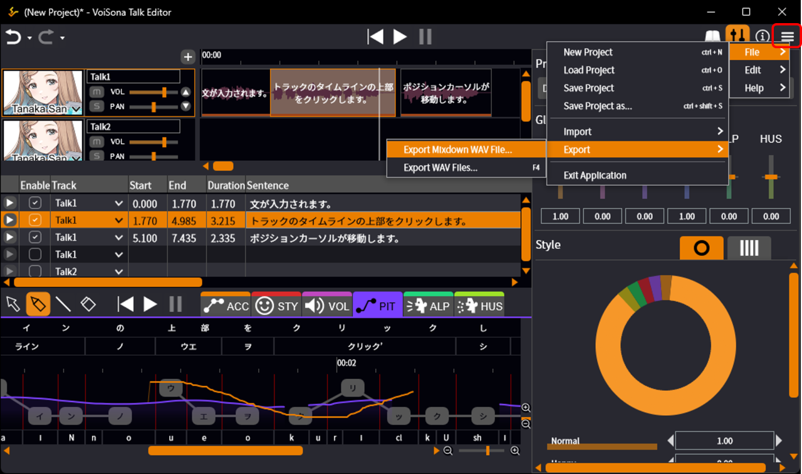
19. 选择保存位置，输入文件名，点击「保存」。  
   WAV 文件将保存到指定位置。
