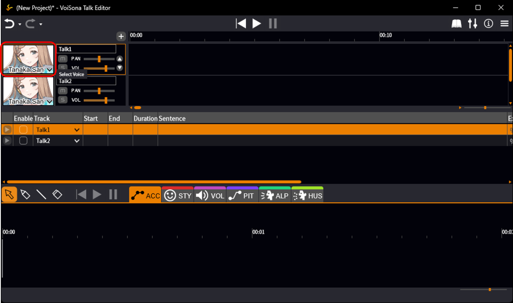
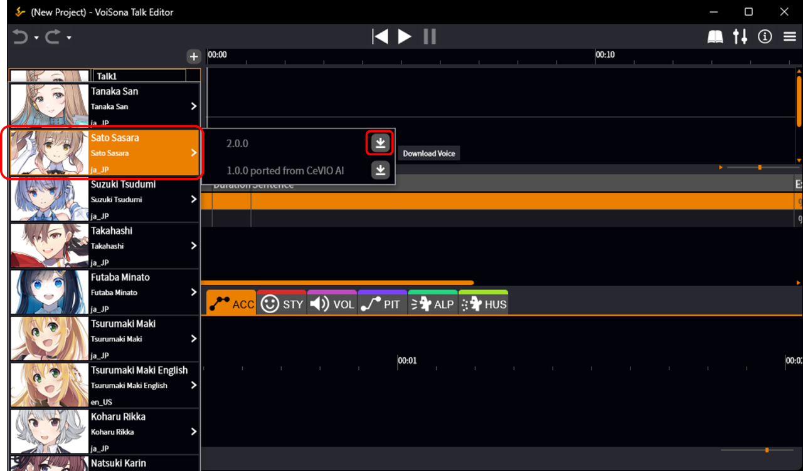
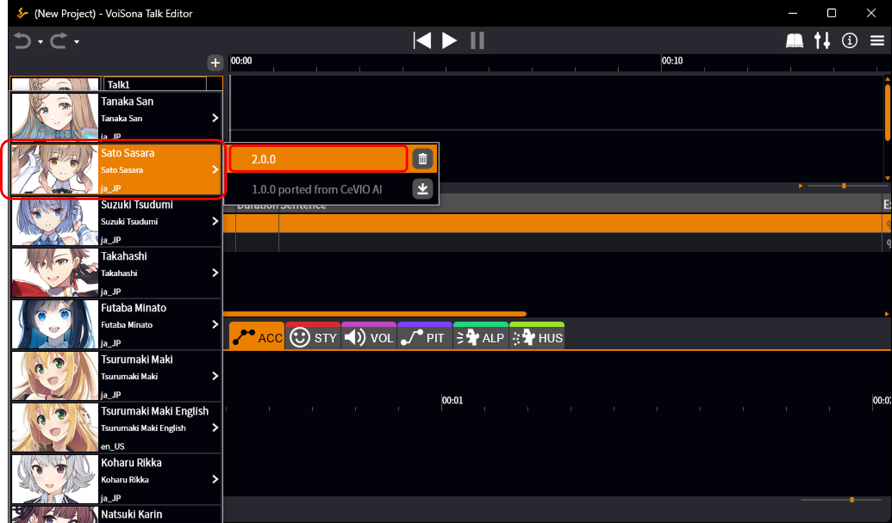
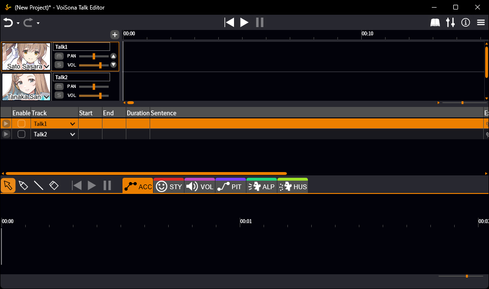
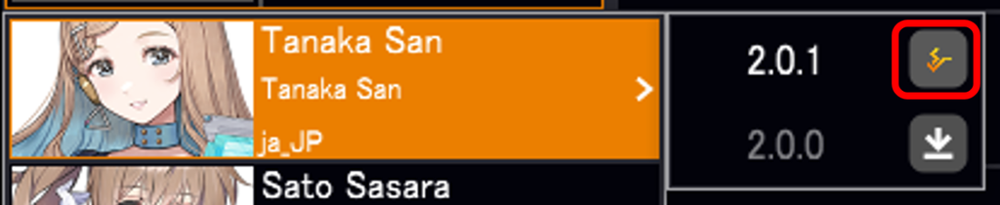

原文：[ボイスライブラリを選択する](https://manual.voisona.com/en/talk/pc/2b6e9bc7efb180e494d2c2f17444e669)

---

# 选择声库

可以从声库中选择一个来朗读台词。

## 下载并选择声库

可以从已订阅的声库中选择您喜欢的版本使用。

1. 点击显示「选择声库」的区域。
   
2. 将光标对准想要使用的声库。
3. 点击想要使用的版本对应的「下载声库」按钮。  
   声库下载将开始。  
   下载完成后，声库选择画面将会关闭。
   

    !!! info
        在没有安装过声库的情况下首次下载时，下载后会自动选中该声库。

4. 再次打开声库选择画面，点击版本号。  
   乐谱编辑画面将显示出来，并显示所选声库的图像。
   
   

    !!! info "如果「下载声库」按钮未显示的话"
        点击显示的按钮前往 [DOWNLOAD](https://voisona.com/talk/download/) 页面，将 VoiSona Talk 更新到最新版本。  
        更新后重启 VoiSona Talk，就会出现「下载声库」按钮。  
        请注意，如果您运行的 VoiSona Talk 版本过旧且不支持相关声库，则不会显示「下载声库」按钮。
        

## 添加声库

按照以下步骤即可添加声库。

1. 从官方网站的 [ARTIST](https://voisona.com/talk/artist/) 页面购买声库。
2. 重启 VoiSona Talk 应用。

    !!! info
        当您[登录](login.md)拥有声库授权的账户后，声库将自动添加到可用声库列表中。

3. [下载并选择声库](#_1)。
