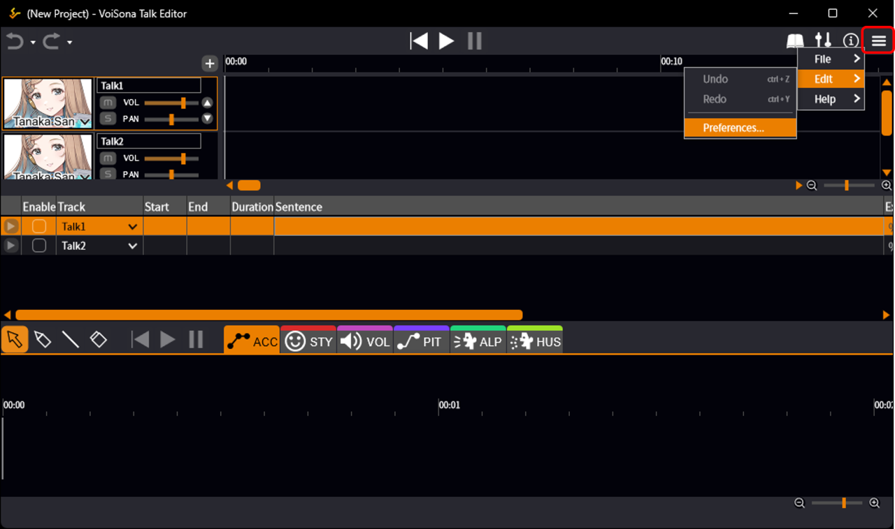
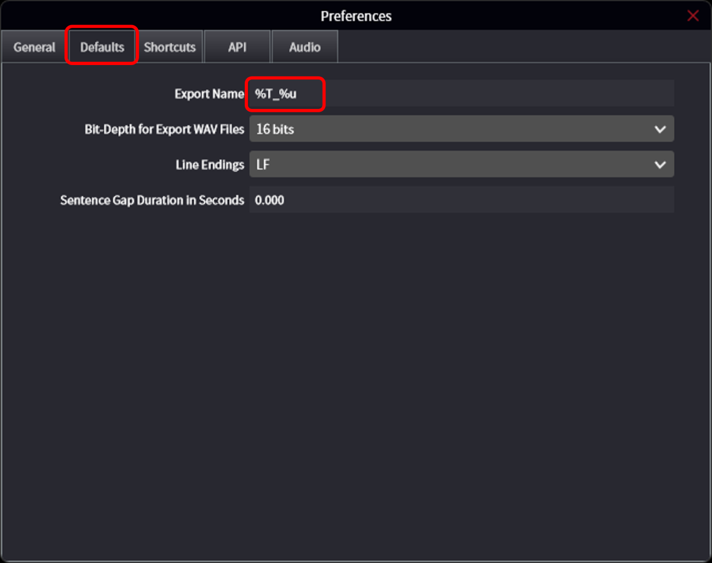
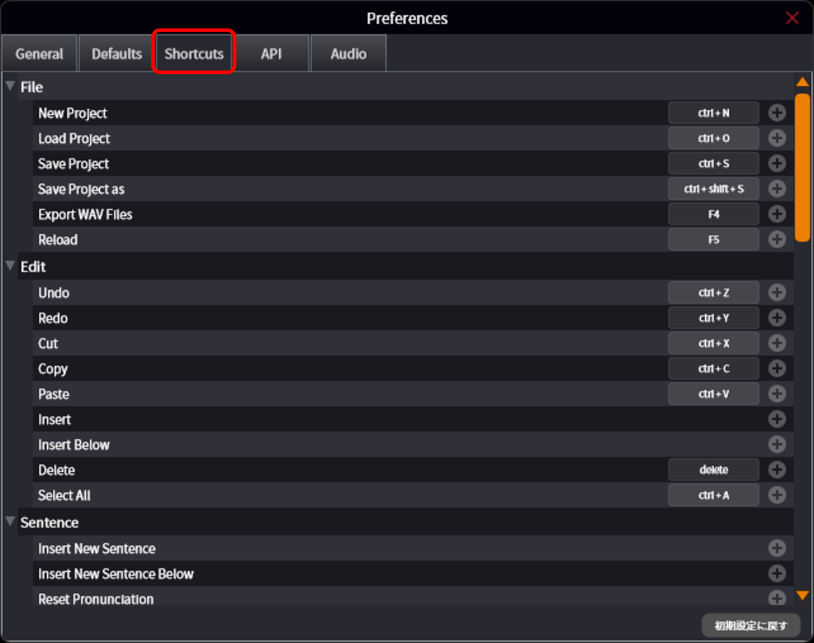

原文：[環境設定を変更する](https://manual.voisona.com/en/talk/pc/2b6e9bc7efb180b8bee8df2ff18bc172)

---

# 更改环境设置

可以更改语言设置、编辑器整体行为以及快捷键分配等。

1. 点击「菜单」按钮，选择「编辑」>「环境设置」。
   
2. 切换标签页，进行各种设置。

!!! info
      在「默认值」中可以更改默认导出名称。  
      另请参阅[替换导出名称中的字符串](./import-export.md#_8)。
      

!!! info
      在「快捷键」设置画面中，可以自由更改各操作分配的按键。

      善用快捷键可以大幅提高工作效率，请务必利用。
      
